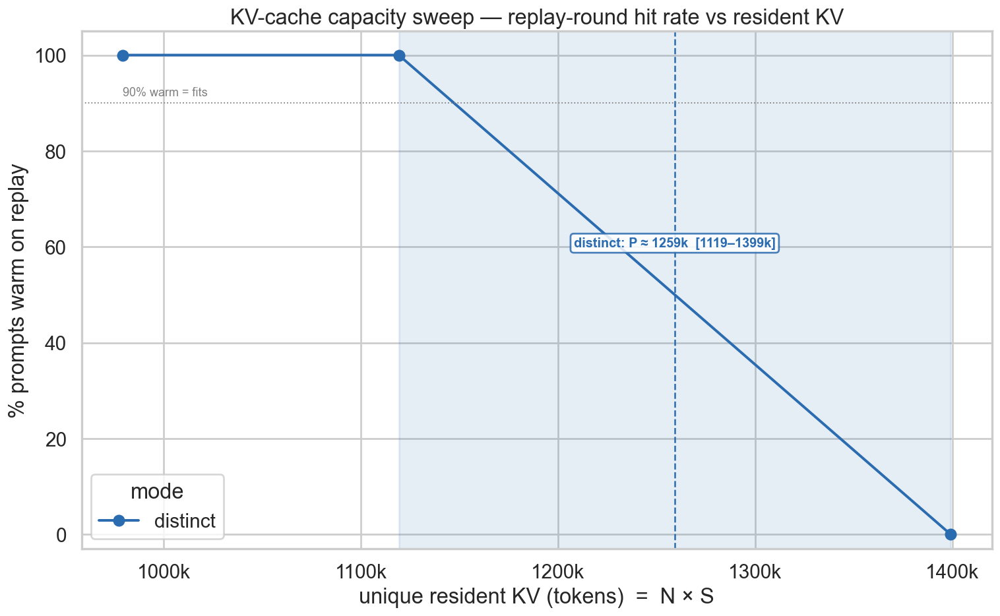

# GPU Scaling Experiments

Measuring the **true KV-cache capacity** of Qwen 3.6 27B (FP8) on a single
H200, and projecting how prompt-caching, CPU offload, and `max_num_seqs`
trade off against per-user decode speed for agentic coding workloads.

The full write-up — setup, method, results, and recommendations — is in
**[docs/writeup.md](docs/writeup.md)**.

> **Extended study:** [docs/scenarios.md](docs/scenarios.md) carries the same
> methodology to **2×H200** (tensor- vs data-parallel), the **35B-A3B MoE** model,
> **subagent** workloads, **system-prompt size**, and a **cache-invalidation** rate —
> with an interactive explorer at [`interactive/index.html`](interactive/index.html).
> The 2026-07 extension adds the **B300** (Blackwell Ultra) as a selectable GPU,
> **NVFP4 weight quantization** (B300-only, weights-never-KV, available for all
> four models), and two more models: **Mistral-Medium-3.5-128B** (dense GQA,
> 176 KiB/token KV) and **GLM-5.2** (744B-A40B, MLA + DeepSeek Sparse Attention,
> sparse decode pricing). See docs/scenarios.md § Extension.

## Key findings

- vLLM 0.19.0 mis-reports the KV cache size (`352k tokens`) due to a
  [known bug](https://github.com/vllm-project/vllm/issues/37121). Direct
  measurement puts the true capacity **P in [1139k, 1399k] tokens** — enough
  to hold the full KV of **4–5 max-length (262k) sequences**.
- The reported `Maximum concurrency 5.1×` (≈1337k tokens) *does* land inside
  the measured interval, so that figure looks correct even though the token
  count printed next to it does not.
- Lowering `max_seq_len` to 180k, enabling FP8 KV cache, and CPU/RAM offload
  each expand how many sessions can be kept warm; sharing a stable prefix
  across agent turns is the biggest production win.
- A 2×H200 tensor-parallel bring-up of the 27B (FP8 weights, FP16 KV) reported
  **3,233,564** KV-cache tokens at startup — within 0.3% of the extended
  model's prediction, its first non-circular validation (see
  [docs/scenarios.md](docs/scenarios.md), § Measured cross-check).



## Repository layout

```
.
├── README.md                 # this file
├── pyproject.toml            # project + dependencies (managed with uv)
├── uv.lock                   # pinned, reproducible environment
├── docs/
│   ├── writeup.md            # baseline experiment write-up
│   └── scenarios.md          # extended-scenario study (2xH200, MoE, subagents, …)
├── scripts/                  # figure-generating scripts (matplotlib, Agg)
│   ├── warm_capacity.py      # baseline: synthetic capacity/concurrency projections
│   ├── real_capacity.py      # baseline: clean → fit log-normal → MC warm-fill
│   ├── real_mns.py           # baseline: max_num_seqs speed/throughput tradeoff
│   ├── warm_whisker.py       # baseline: warm capacity p5/p50/p95 whiskers
│   ├── scenario_model.py     # extended study: shared capacity + decode model (+ self-checks)
│   ├── scenarios.py          # extended study: renders the scenario figures
│   └── tables.py             # extended study: regenerates every number in scenarios.md
├── interactive/
│   └── index.html            # self-contained interactive scenario explorer
├── research/
│   ├── model_35ba3b.md       # cited architecture parameterization for 35B-A3B
│   ├── model_mistral_medium35.md  # Mistral-Medium-3.5-128B constants + sources
│   ├── model_glm52.md        # GLM-5.2 (MLA+DSA) constants + sources
│   ├── gpu_b300.md           # B300 (Blackwell Ultra) hardware constants
│   └── nvfp4.md              # NVFP4 format, B300-only gate, Qwen NVFP4 bytes
├── figures/                  # generated figures used in the write-ups
└── data/                     # provider CSVs (not committed — see data/README.md)
```

## Running the scripts

The project is managed with [uv](https://docs.astral.sh/uv/) — dependencies live
in `pyproject.toml` and are pinned by `uv.lock`. `uv run` creates/updates the
environment automatically on first use (or run `uv sync` explicitly):

```bash
# fully synthetic — runs out of the box, writes to figures/
uv run scripts/warm_capacity.py

# real-data scripts need the two CSVs described in data/README.md
uv run scripts/real_capacity.py
uv run scripts/real_mns.py
uv run scripts/warm_whisker.py
```

Each script writes its PNGs into `figures/`. Override the input and output
locations with environment variables:

```bash
DATA_DIR=/path/to/csvs OUT_DIR=/tmp/figs uv run scripts/real_mns.py
```

### Script → figure map

| Script              | Figures                                                             | Needs CSVs |
| ------------------- | ------------------------------------------------------------------ | ---------- |
| `warm_capacity.py`  | `warm_by_scenario.png`, `peruser_vs_mns.png`, `throughput_tradeoff.png` | no     |
| `real_capacity.py`  | `real_dist_fit.png`, `real_warm_mc.png`                             | yes        |
| `real_mns.py`       | `real_mns_tradeoff.png`                                             | yes        |
| `warm_whisker.py`   | `warm_whisker.png`                                                  | yes        |

The experimental result `figures/prefix_cache_sweep.png` comes from the live
prompt-caching sweep (not one of these scripts).

### Extended-scenario study

```bash
uv run scripts/scenario_model.py   # self-checks (calibration + published-config identities)
uv run scripts/scenarios.py        # renders scenario_capacity / sysprompt / mns / subagent_invalidation .png
uv run scripts/tables.py           # regenerates every number quoted in docs/scenarios.md
```

`scripts/scenario_model.py` is the shared model (calibrated to the baseline's
2.77M-token FP8 anchor — projected from the measured FP16 pool, see
docs/scenarios.md limitations; 35B-A3B constants from the published
Qwen3.6-35B-A3B config — see `research/model_35ba3b.md`; an FP8/FP16 KV-cache
switch is available via `with_kv_dtype`, FP8 being the studied default, and an
FP8/NVFP4 *weight* switch via `with_weight_dtype` — NVFP4 being gated to the
B300's native FP4 tensor cores and never applied to the KV cache; topologies are
a `DP × TP` grid via `topology_grid(dp, tp, gpu)`, so a replica is a *group* of
GPUs — the only way the models that fit no single GPU, Mistral-Medium-3.5 and
GLM-5.2, can be data-parallel at all, with `min_tp_for` / `node_splits` giving
the fitting splits of an 8-GPU node);
`scripts/scenarios.py` renders the static figures; and `interactive/index.html`
is a dependency-free page mirroring the same math with live sliders for the
workload, model (Qwen3.6-27B / 35B-A3B / Mistral-Medium-3.5 / GLM-5.2), GPU
(H200 / B300), weight & KV dtypes, and topology. See
[docs/scenarios.md](docs/scenarios.md).
