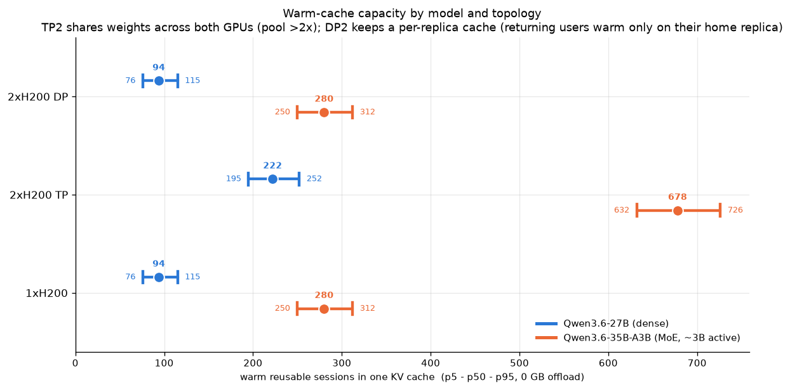
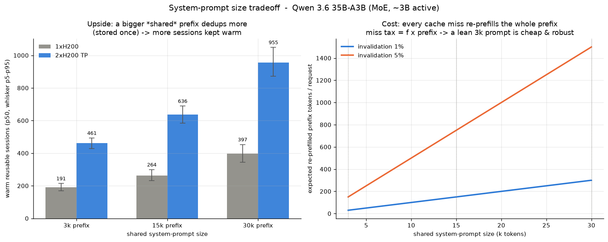
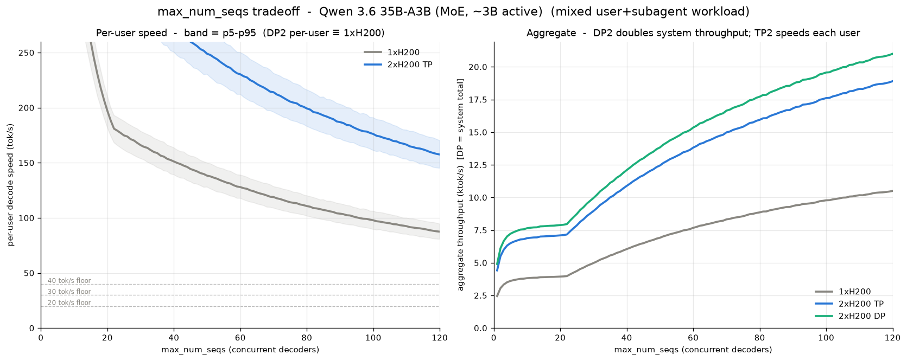
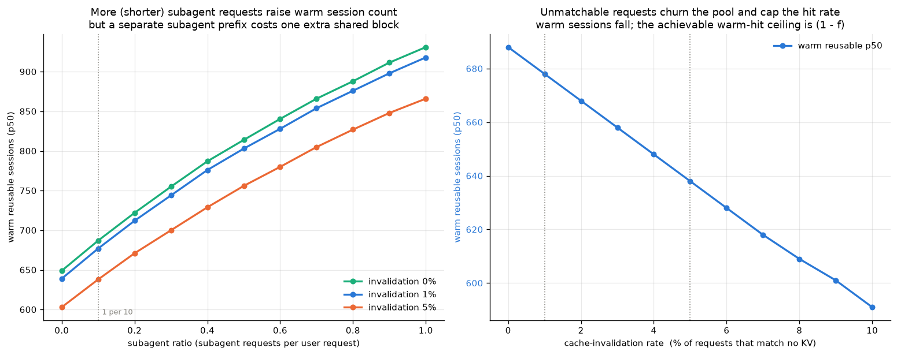
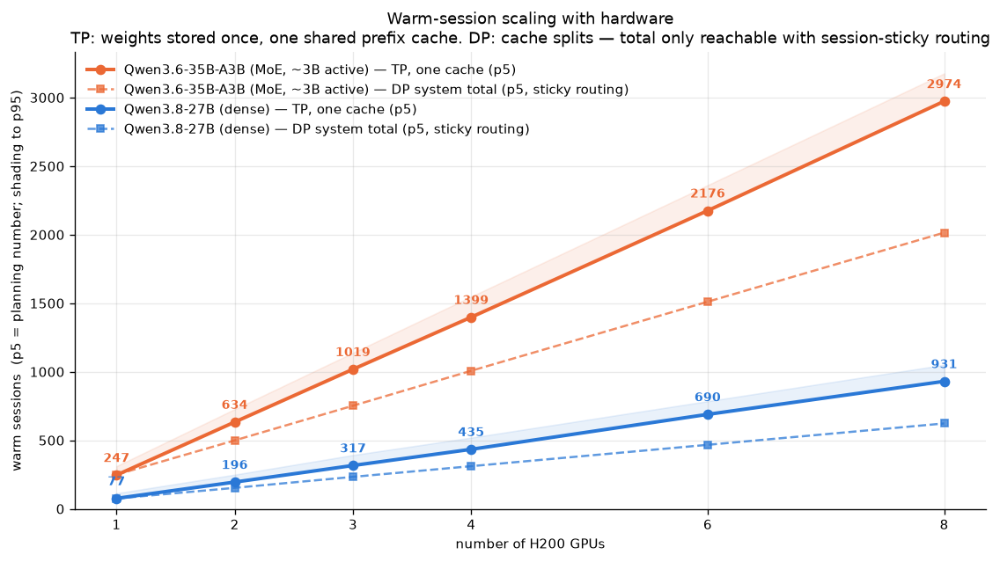
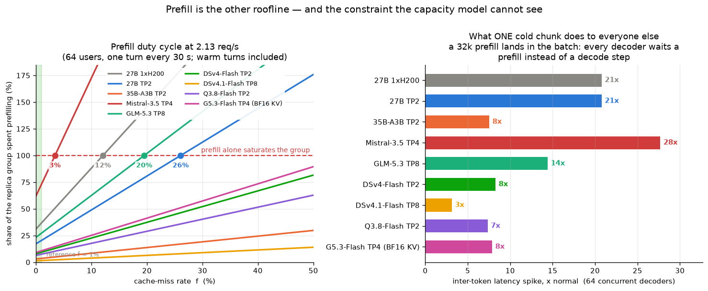
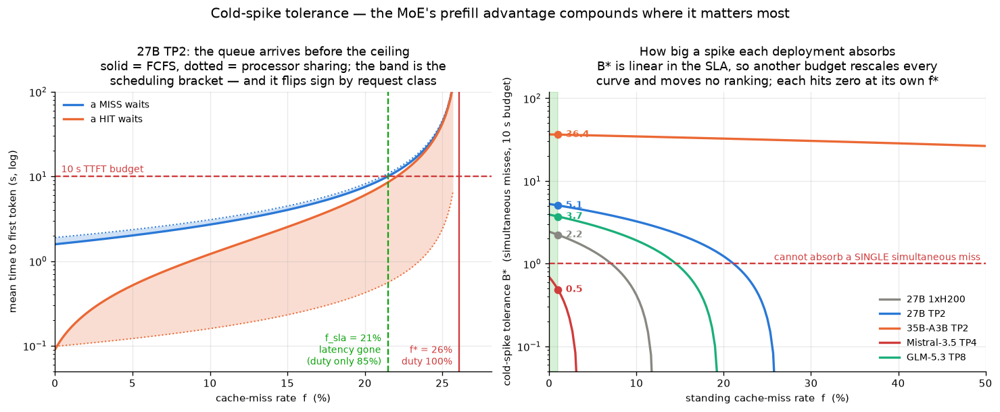
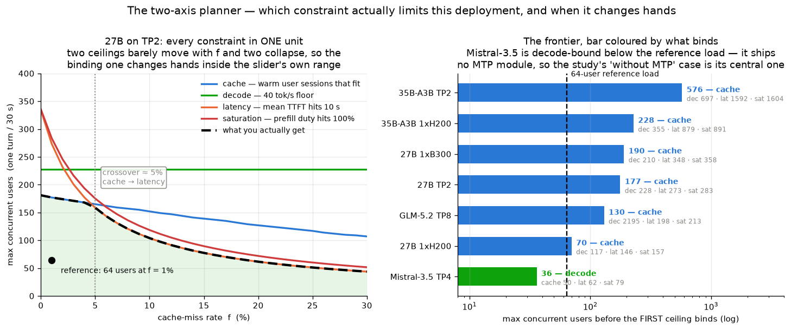

# Extended scenarios: 2×H200, Qwen3.6-35B-A3B, subagents, prompt size, cache invalidation

**Decision question.** How many agentic-coding users can we serve *comfortably* per
hardware / vLLM configuration — where "comfortably" means a returning user's next
request hits the warm prefix cache (TTFT of seconds, not a full re-prefill) **and**
their decode speed stays above a 40 tok/s hard floor (50 tok/s is comfortable)?

**Primary metric and working hypothesis.** The study's central simplification: **a
request served from a warm session is a request served well and comfortably**, while
a cold request must re-prefill its entire context — a burst of prefill work that
briefly steals GPU bandwidth from *every* active user (thrash). We therefore size
deployments by **how many sessions stay warm**, and we plan on the **p5** of that
count (the conservative tail: 95% of Monte-Carlo draws hold at least that many),
not the median. Decode-speed results exist mainly to *verify* that speed is not the
binding constraint — they are not the planning number.

This extends the [baseline study](writeup.md) along five axes, keeping the **same
methodology** (transparent memory model + Monte-Carlo pool fill + a bandwidth-bound
decode model). All numbers come from one shared model,
[`scripts/scenario_model.py`](../scripts/scenario_model.py); every table below
regenerates via [`scripts/tables.py`](../scripts/tables.py), and the interactive
explorer ([`interactive/index.html`](../interactive/index.html)) mirrors the same
math with live sliders.

## What changed vs the baseline

| Axis | Baseline | Extended |
| --- | --- | --- |
| GPUs | 1×H200 | + 2×H200 **tensor-parallel (TP2)** and **data-parallel (DP2)** |
| Model | Qwen3.6-27B (dense) | + **Qwen3.6-35B-A3B** (MoE, ~3B active) — published config |
| Workload | single user class | + **subagent** class (own log-normal, mixed at ratio *r*) |
| System prompt | 15k shared prefix | swept: **3k / 15k / 30k** |
| Caching | full hit / full miss | + **invalidation rate *f*** (requests that match no KV) |
| GPU part *(2026-07)* | H200 only | + **B300** (Blackwell Ultra, 288 GB / 8 TB/s) — [§ Extension](#extension-2026-07-b300-gpus-nvfp4-weights-mistral-medium-35-glm-52) |
| Weight dtype *(2026-07)* | FP8 | + **NVFP4** (B300-only; weights, never KV) |
| Models *(2026-07)* | — | + **Mistral-Medium-3.5-128B** (dense GQA) and **GLM-5.2** (744B-A40B, MLA+DSA) |
| Models *(2026-08)* | — | + **DeepSeek-V4-Flash-0731** (284B-A13B, CSA) and **Qwen3.8-Flash-Next** (125B-A6B, QSA + n-gram) — in the explorer and `tables.py`; the § tables below predate them ([`research/model_dsv4flash.md`](../research/model_dsv4flash.md), [`research/model_qwen38flashnext.md`](../research/model_qwen38flashnext.md)) |

Model refinements over the first draft of this study (each moves numbers by 10–20%):

1. **Real Qwen3.6-35B-A3B constants.** The first draft used provisional proxy
   constants; the published 35B-A3B config differs materially (40 layers, 10
   full-attention layers, 256 experts with 8 routed, vocab 248,320). See
   [`research/model_35ba3b.md`](../research/model_35ba3b.md) for the derivation —
   notably, the published config lands on ~35B total with **no interpolation**.
2. **Recurrent state is charged to the pool.** A warm hit on a hybrid model needs the
   constant Gated-DeltaNet state, not just the attention KV, so every resident session
   is charged `state / kv_bpt` token-equivalents (2.4k for 27B, 3.3k for 35B-A3B).
   The baseline scripts omitted this; it costs ~11% of warm capacity.
3. **Recurrent-state bandwidth in decode.** Each decode step reads *and writes* every
   active sequence's DeltaNet state (2 × state × n bytes). Negligible at the
   baseline's `max_num_seqs = 6` (<2% of step bytes), no longer negligible at 64+.
4. **Expert-union bracketing.** MoE weight-read growth is reported under two models:
   a **linear no-overlap bound** `min(n·w_pertok, w_total)` (a true upper bound on
   bytes — the conservative planning default) and the **expected union under
   i.i.d. uniform routing** `w_total·(1−(1−8/256)^n)` (a reference curve, not a
   bound: routing correlation typically shrinks the union further, but load
   balancing could widen it).

## Hypotheses

Stated up front, with predicted direction; outcomes are in [§ Outcomes](#outcomes).

- **H1 — MoE memory.** The hybrid DeltaNet/attention layout gives the 35B-A3B
  10 KiB/token of KV (vs 32 KiB for the 27B), so at equal hardware it keeps
  **≥ 2.5× more sessions warm** despite ~4 GiB more resident weights.
- **H2 — TP2.** Sharding weights across two GPUs frees a weight-copy's worth of HBM
  for KV: the pool grows **more than 2×**, and per-user decode speeds up ~1.8×
  (2 × bandwidth × 0.90 comm haircut).
- **H3 — DP2.** Two replicas double aggregate throughput but split the prefix cache;
  per-cache warm capacity equals 1×H200 and returning users are warm **only with
  sticky routing**.
- **H4 — System prompt.** A genuinely shared prefix is stored once and deduped by
  every session, so a *bigger* prefix **raises** warm capacity; its real cost is the
  miss path (every unmatchable request re-prefills `f × prefix` tokens).
- **H5 — Subagents.** A short-prompt request class (median 8k vs 31k) raises the warm
  session *count* at equal pool, at the cost of one extra shared prefix block.
- **H6 — Invalidation.** A fraction *f* of requests matching no cached KV reduces warm
  capacity near-linearly (≈ 1.5 × *f*) and caps the warm-hit rate at **1 − f**; at the
  assumed 1% the capacity cost is ~1.5%.
- **H7 — Binding constraint.** For this workload, **warm-cache capacity binds before
  decode bandwidth**: the number of users whose sessions fit warm in the pool is
  smaller than the number of concurrent decoders the bandwidth could carry at
  40 tok/s.
- **H8 — Cold spikes** *(added 2026-08-03, after § 8 gave prefill a price)*.
  Because a miss's service time is quadratic in a lognormal context length, the
  prefill queue is dominated by variance rather than by the mean: **TTFT breaches
  a latency budget well below f\***, and the burst a deployment can absorb goes
  to zero *at* f\*. The MoE's active-parameter prefill advantage should therefore
  **compound** into spike tolerance (cheap misses *and* low standing load), except
  on a global flush, where its larger warm population is the thing being
  re-prefilled and the advantage should partly cancel.
- **H9 — The steady state is not the stress test** *(added 2026-08-07)*. Every
  decode figure this study publishes prices the whole warm population decoding
  at once. Because arrivals are open-loop — a user waits out most of the
  think-time interval on a tool or a human — the batch a given load actually
  produces should be **an order of magnitude smaller**, and the per-user speed
  correspondingly **several times higher**, than the stress figure. The gap
  should widen with the machine's decode headroom (worst on the configs the
  study already calls comfortable) and vanish on the config decode already
  binds.

## Model

### Memory / capacity

The KV pool is derived from a transparent budget, **calibrated** so that
1×H200 + 27B reproduces the baseline's 2.77M-token FP8 pool. That anchor is itself a
**projection**, not a direct measurement: the baseline measured the FP16 pool
(P ∈ [1139k, 1399k], best estimate ~1337k tokens) and projected FP8 as ~2× plus freed
activation memory. Calibration fixes the per-GPU activation/workspace reserve at
≈ 18.0 GiB:

```
ACT_RESERVE = VRAM_per_GPU − W_resident(27B) − 2.77e6 · KV_bpt(27B)

pool_tokens(per replica group)   = (tp·VRAM − W_resident − tp·ACT_RESERVE) / KV_bpt
```

Weights are sharded across the `tp` GPUs of a replica group and so are counted
**once**; the activation reserve is scratch and charged **per GPU**. Substituting
`tp=1` recovers the single-GPU and DP-replica cases and `tp=2` the TP2 case, so
every number in this study is unchanged. See [§ Topology](#topology-a-dp--tp-grid).

Warm-capacity Monte Carlo (one cache): reserve the distinct shared-prefix blocks once
(user prefix, and the subagent prefix unless shared); fill the remaining budget in
arrival order with each session's **unique** tokens `max(clip(L, cap) − prefix, 0)`
**plus its recurrent-state charge** `state / KV_bpt`; a **cold** session contributes
its *full* length and is subtracted from the warm count. CPU offload adds sessions at
`unique·KV_bpt + state` bytes each until the RAM buffer is full. We report p5/p50/p95
over the draws for three counts: every warm session (`which="all"`, the storage view),
user-class sessions only (`which="user"`), and HBM-resident sessions only
(`which="gpu"` — the count decode figures are built on, since an offloaded session
cannot decode until it is restored).

### Decode speed (bandwidth-bound, MoE-aware)

```
step_bytes(n) = w_decode(n) + (Σ active-context tokens)·KV_bpt + 2·n·state
w_decode(n)   = w_shared + min(n·w_pertok, w_total)      # conservative default
              | w_shared + w_total·(1−(1−8/256)^n)       # expected-union bracket
per_user      = MTP · BW_eff / step_bytes(n)      aggregate = n · per_user · replicas
```

`BW_eff = tp · HBM_BW · tp_efficiency(tp)` — the bandwidth of **one replica
group**, i.e. `HBM_BW` at `tp=1` (single / DP replica) and `2·HBM_BW·0.90` at
`tp=2`. DP adds groups; it never widens one, so `replicas` enters only in the
aggregate. Dense: `w_decode = W_resident` (every step reads all weights).

### Topology: a DP × TP grid

The unit DP replicates is a **group of `tp` GPUs, not a GPU**. Total GPUs =
`dp · tp`; each group shards one copy of the weights, owns one independent KV
cache, and has its own bandwidth.

That distinction is invisible for the 27B and 35B-A3B, which fit in one GPU on
either part, and **load-bearing wherever a model does not** — which for the two
models added in 2026-07 is every cell below except one:

| min TP to fit FP8 weights | H200 | B300 |
| --- | --- | --- |
| Mistral-Medium-3.5-128B (133.6 GB) | **2** | 1 — *fits a single B300* |
| GLM-5.2 (755.5 GB) | **7** | **3** |

In every bolded cell, `topology("dp", n)` — *n* independent **single** GPUs — is
not a deployment that exists: no number of single GPUs ever holds the weights,
so the entire DP axis reported a 0-token pool at every *N*. (Mistral-Medium-3.5
on B300 is the exception — min TP 1, so pure DP is real there, and it appears as
the `DP8×TP1` column below.) Data parallelism in the other cells means
replicating whole **TP groups**, which `topology_grid(dp, tp)` now expresses.

These min-TP figures use the calibrated `ACT_RESERVE ≈ 18.0 GiB`, and there is
now only one such figure per configuration: the explorer's low-anchor case —
which raised the reserve to 33.0 GiB and pushed GLM-5.2 to 8 on H200 / 4 on
B300 — was retired 2026-07-29 (§ Measured cross-check). The explorer's
`minTpFor` and Python's `min_tp_for` therefore always agree.

The splits of one 8-GPU node that actually fit (FP8 weights, FP8 KV;
`system = replicas × per-group`, and only with session-sticky routing):

| Model | Part | DP8×TP1 | DP4×TP2 | DP2×TP4 | TP8 |
| --- | --- | --- | --- | --- | --- |
| Mistral-Medium-3.5 | H200 | — *(no fit)* | 0.61M ×4 = **2.44M** | 1.96M ×2 = **3.92M** | 4.66M = **4.66M** |
| Mistral-Medium-3.5 | B300 | 0.70M ×8 = **5.58M** | 2.14M ×4 = **8.55M** | 5.01M ×2 = **10.03M** | 10.77M = **10.77M** |
| GLM-5.2 | H200 | — | — | — *(needs TP7)* | 4.50M = **4.50M** |
| GLM-5.2 | B300 | — | — | 5.82M ×2 = **11.65M** | 27.25M = **27.25M** |

**Widening TP raises the system total**, because every DP group re-pays for its
own full copy of the weights. On a fixed node of *N* GPUs the total has a closed
form that makes this exact:

```
system(tp) = [ N·(V − R) − N·W / tp ] / KV_bpt        V = vram, R = reserve, W = weights
```

It depends on `tp` **only** through the `− N·W/tp` term, so it is monotone
non-decreasing always, and *strictly* increasing exactly when the weight charge
`W` is positive and numerically material. A weightless model is flat; every real
model here has material weights, so the margin scales with `W` — on 8 GPUs, TP8
beats the widest fitting DP split by **1.36×** for the 35B-A3B (35.5 GB),
**1.91×** for Mistral-Medium-3.5 (133.6 GB) and **2.34×** for GLM-5.2 (755.5 GB).

DP buys cache isolation and routing headroom, never capacity — the same
conclusion [§ 5](#5-scaling-to-n--h200) reached for the 35B-A3B, but far sharper
the heavier the weights.

**TP is bounded by the node.** TP all-reduces fire twice per layer and are
latency-critical, so they are only cheap inside the node's NVSwitch fabric.
`GPU.nvlink_domain` is **8 for both parts** — HGX H200 and the 8-GPU HGX B300
baseboard we deploy. `tp_efficiency` keeps the measured-regime `0.90` haircut per
doubling up to that boundary, then applies an additional
`CROSS_DOMAIN_EFFICIENCY = 0.65` per doubling beyond it.

> **Unmeasured.** The cross-node penalty is a deliberately pessimistic guess
> whose purpose is to stop the in-node haircut being extrapolated to multi-node
> TP, where it would badly overstate throughput. **No configuration in this study
> crosses the boundary**, so it bounds the extrapolation rather than predicting
> it. Treat any `tp > 2` figure as a projection needing measurement.

**In the explorer.** The **Split (DP × TP)** control offers exactly the legal
splits of the chosen GPU count — the divisors of *N*, so `N=8` gives
`DP8 / DP4×TP2 / DP2×TP4 / TP8` and `N=6` gives `DP6 / DP3×TP2 / DP2×TP3 / TP6`.
Every row of the table above is therefore reachable interactively. Splits whose
TP group is too small to hold the weights are struck through, and selecting one
reports the threshold ("needs TP ≥ 7 on H200") rather than a bare "does not
fit". Changing the GPU count snaps the TP width to the largest divisor that does
not exceed the current one, so shrinking *N* keeps as much TP as still divides
evenly instead of resetting to an end of the range.

### Model constants

| Constant (FP8) | Qwen3.6-27B (dense) | Qwen3.6-35B-A3B (MoE) |
| --- | --- | --- |
| KV bytes / token | 32 KiB (16 attn × 4 KV × 256 × 2) | **10 KiB** (10 attn × 2 KV × 256 × 2) |
| DeltaNet state / session (bf16) | 75 MiB | **31.9 MiB** |
| Resident weights | 28.8 GiB (as deployed) | 33.1 GiB (~35.5B params) |
| Weight bytes read / decode step | 28.8 GiB (all) | 1.81 GiB shared + up to 30.0 GiB routed |
| Active weights / token | — (dense) | ~2.95 GB (published "~3B") |
| Expert-union saturation (linear) | — | n = 32 (= 256 experts / 8 per token) |
| KV pool, 1×H200 | 2.77M tok (measured anchor) | **8.42M tok** |
| KV pool, 2×H200 TP2 | 6.48M tok | **20.30M tok** |
| MTP decode speedup | 1.7× (α ≈ 47% per-draft acceptance) | 1.7× (transplanted fit) |

Both columns now come from **published configs** (the 27B's 64-layer / 16-full-attn /
4-KV-head config reproduces the baseline's 32 KiB/token exactly). The 35B-A3B's
KV/token is **3.2× smaller** than the 27B's because only 10 of its 40 layers hold a
growing KV cache. Provenance and full arithmetic:
[`research/model_35ba3b.md`](../research/model_35ba3b.md).

**MTP speedup ⇔ acceptance.** The 1.7× figure is the base speedup derived from the
baseline's measured fit. Under the MTP-2 accept-until-reject model (two draft
tokens per forward pass), `speedup = 1 + α + α²` where **α is the per-draft
acceptance rate**; 1.7× ⇔ **α ≈ 47%**. That α is the underlying quantity — the
speedup is computed from it, and a measured 87% acceptance would give ≈ 2.6×.
The explorer exposes the speedup as a continuous knob (1.0× = MTP off) and
displays the implied α next to it; in Python, `mtp_speedup(alpha)` in
`scenario_model.py` maps acceptance to speedup.

### KV-cache dtype switch (FP8 default / FP16)

Every number in this study assumes the **FP8 KV cache** (`--kv-cache-dtype
fp8_e4m3`), as tested in the baseline. The model exposes a switch
(`with_kv_dtype(model, "fp16")` in Python; a Model-panel toggle in the explorer)
that doubles KV bytes/token — halving the pool and adding decode read cost —
while weights, the DeltaNet state, and the FP8-anchored reserve calibration stay
fixed. Consistency check: the FP16 27B/1×H200 pool comes out at **1.39M tokens**,
inside the baseline's *measured* FP16 interval [1.14M, 1.40M]. Note this is
**partially circular** (the FP8 anchor was built as ~2× the FP16 estimate, so
halving it lands near the measurement largely by construction) — it confirms
internal consistency, not the model. The TP2 measured cross-check below is
*not* circular: nothing about TP2 was fitted. Reference-workload numbers under
FP16 (from `tables.py`):

| FP16 KV | pool | warm p50 (user) | per-user p50 @ mns 64 |
| --- | --- | --- | --- |
| 27B, 1×H200 | 1.39M | 49 (45) | 39 tok/s |
| 27B, TP2 | 3.24M | 116 (105) | 71 tok/s |
| 35B-A3B, 1×H200 | 4.21M | 148 (134) | 90 tok/s |
| 35B-A3B, TP2 | 10.15M | 358 (326) | 162 tok/s |

Warm capacity retains slightly *more* than half its FP8 value (the per-session
state charge is dtype-independent, so it shrinks in token-equivalents as KV bytes
grow). Note the 27B on one GPU drops below the 40 tok/s hard floor at mns 64
under FP16 — the quantitative version of the baseline's "FP8 KV doubles P"
recommendation.

### Measured cross-check: 27B on 2×H200 TP2, FP16 KV (2026-07-22)

The exact configuration in the second row of the table above was brought up on
real hardware (27B, FP8 weights, FP16 KV cache, `--tensor-parallel-size 2`,
`max_seq_len` 184,320 = 180×1024). vLLM's startup log:

```
INFO vllm.v1.worker.gpu_worker    : Available KV cache memory: 110.59 GiB
INFO vllm.v1.core.kv_cache_utils  : GPU KV cache size: 3,233,564 tokens
INFO vllm.v1.core.kv_cache_utils  : Maximum concurrency for 184,320 tokens per request: 17.54x
```

Three consistency checks, all passing:

1. **Pool size.** The model predicts a TP2 FP16 pool of **3.242M tokens**
   (table above, rounded to 3.24M); vLLM reports **3,233,564** — a **−0.26%**
   difference. Equivalently, run backwards, the log implies a per-GPU
   non-KV overhead of ~18.2 GiB versus the calibrated 18.0 GiB reserve —
   the anchor-derived calibration now has an *independent* measured
   counterpart (the reserve was solved from the 1-GPU FP8 anchor; nothing
   about TP2 or FP16 was fitted).
2. **Internal arithmetic.** 3,233,564 / 184,320 = **17.54** exactly, matching
   the printed concurrency — unlike the baseline's vLLM 0.19.0 log, whose
   token count contradicted its own concurrency figure (the known
   mis-reporting bug), this log is self-consistent.
3. **Hybrid-allocator overhead.** The workers report 2 × 110.59 = 221.2 GiB
   available, but 3,233,564 tokens × 64 KiB/token accounts for only
   197.4 GiB of attention KV. The ~11% gap (23.8 GiB) is consistent with the
   hybrid allocator carving Gated-DeltaNet state pages from the same pool —
   directionally matching this study's separate per-session state charge —
   but its sizing is internal to the allocator: at 75 MiB/session it would
   cover ~325 sessions' states, far more than the 17 concurrent max-length
   sequences, suggesting a pre-allocation (e.g. sized to `max_num_seqs` and
   page granularity) rather than per-live-session accounting. The gap's
   *existence* supports charging state separately; its *magnitude* is not
   something this model predicts.

Caveats: this is a *startup-log* figure, not a fill-probe measurement like the
baseline's (no warm/cold sweep was run at this config), and it exercises the
27B path — the 35B-A3B remains unmeasured. With those caveats it independently
validates the ingredients the TP2 projections stack on the anchor: the
weights-counted-once TP arithmetic, the FP16 KV doubling, and the reserve's
*transferability* to a second GPU (the reserve's absolute magnitude is defined
by the anchor, so a globally-wrong anchor would shift both numbers together —
this check cannot catch that; only a direct FP8 re-measurement can).

#### Consequence: the low-anchor assumption is retired (2026-07-29)

Until this log existed, the anchor was the study's single largest structural
unknown, and both `tables.py`'s stacked case and the explorer's *Conservative*
toggle hedged it by re-solving the reserve from **2 × the measured FP16 lower
bound** (2.278M FP8 tokens ⇒ a 33.0 GiB per-GPU reserve). Run through the same
pool arithmetic as the log (regenerate: the "Retired assumption" section of
`tables.py`):

| 1×H200 FP8 anchor | per-GPU reserve | predicted 27B FP16 TP2 pool | vs the 3,233,564 measured |
| --- | --- | --- | --- |
| 2.770M *(in use)* | 17.98 GiB | 3.242M | **+0.26%** |
| 2.278M *(the hedge)* | 33.00 GiB | 2.750M | **−14.96%** |
| 2.762M *(implied by the log)* | 18.24 GiB | 3.234M | — |

A plausible-adverse assumption has to be one the hardware has not already ruled
out, and this one is off by fifteen percent in the direction the measurement
closes. The refutation is internal to the model's own reserve arithmetic — it
assumes the non-KV reserve transfers across KV dtype and topology, the same
assumption every projection in this study makes (see the transferability caveat
above). A reserve that were strongly dtype- or topology-dependent could in
principle resurrect a low FP8 anchor, but it would also make the central
anchor's +0.26% match a coincidence; only a direct FP8 re-measurement settles
that residual. It is gone from both the explorer and the stacked case; `tables.py`
keeps the three-way comparison above as a regression check so the refutation
stays reproducible rather than becoming folklore.

Two things this deliberately does **not** do. It does not re-anchor the model
to the measured 18.24 GiB: the 1.4% reserve gap is worth under 0.5% on every
published figure, which is not worth invalidating every number in this document
for. And it does not retire the *other* structural knobs — the recurrent-state
dtype and the deployed-weight overhead are untouched by this log (see
§ Statistical honesty).

Reference workload for all static figures: users ~ log-normal(median 31k, σ 0.81)
behind a **15k** system prompt; subagents ~ log-normal(median 8k, σ 0.9) behind a
leaner **3k** separate prefix; subagent ratio **r = 0.1**; **f = 1%**
invalidation; 180k `max_seq_len` cap; lengths floored at their own prefix.

**What σ means here.** σ is the log-normal *shape* parameter — the standard
deviation of ln(length), not of the length itself. The user-class values
(median 31k, σ 0.81) were obtained by a maximum-likelihood `lognorm.fit` on the
baseline's cleaned empirical prompt lengths (1,850 real requests; see
`scripts/real_capacity.py` and the fit overlay in the baseline write-up), so σ
is measured, not assumed (the subagent σ 0.9 *is* assumed — no subagent trace
exists yet). Read it as a multiplicative spread: ~68% of prompts land within
×/÷ e^σ ≈ 2.25 of the median (roughly 14k–70k), the p95 prompt is
e^(1.645·σ) ≈ 3.8× the median (~118k), and the *mean* sits e^(σ²/2) ≈ 1.39×
above the median (~43k). That last ratio is why σ matters for capacity: warm
capacity ≈ pool / E[unique tokens], and the mean — not the median — sets
E[unique]. Raising σ at a fixed median fattens the tail of huge, pool-hogging
sessions (partly clipped by the `max_seq_len` cap) and lowers the warm count
even though the "typical" prompt is unchanged.

**What the subagent ratio means.** `r` counts **subagent requests per user
request**, so the subagent share of the sampled mixture is r/(1+r) — r = 0.1
means 1 subagent request for every 10 user requests, i.e. ~9% of sessions;
r = 1 means half the mix. Subagents draw from their own, much shorter
log-normal and dedup against their own lean 3k prefix (unless the share-prefix
toggle points them at the user prefix), which is why raising r *increases* the
warm-session count: more, smaller sessions pack into the same pool — but each
warm subagent session is worth less than a warm user session, which is why the
decision table also reports the user-class-only count.

## Scenario results

### 1. Warm capacity by model × topology (H1, H2, H3)



Warm **reusable** sessions in one KV cache (p5 / **p50** / p95), reference workload,
0 GB offload:

| | 1×H200 | 2×H200 TP2 | 2×H200 DP2 (per cache) |
| --- | --- | --- | --- |
| 27B | 76 / **94** / 115 | 195 / **222** / 252 | 76 / **94** / 115 |
| 35B-A3B | 250 / **280** / 312 | 632 / **678** / 726 | 250 / **280** / 312 |

(1) The MoE keeps **~3.0× more** sessions warm than the 27B at equal hardware
(280 vs 94; 678 vs 222) — driven by 10 vs 32 KiB/token. (2) **TP2** gives **2.3–2.4×**
the single-GPU pool (20.30 vs 8.42M tokens): the second weight copy it avoids becomes
KV. (3) **DP2's per-cache capacity is unchanged**; system-wide it holds 2 × 280 = 560
(p50 — the p5 planning view in §5 reads 502 vs TP2's 633)
warm sessions across two caches — **less than TP2's 678 in one cache** — and needs
sticky routing. With 600 GiB of CPU offload the 35B-A3B reaches **~2,400** warm
sessions on 1×H200 (~2,780 on TP2) — but see the offload limitation: this is
*storage* capacity; restore latency over PCIe is not modelled.

### 2. System-prompt size — a two-sided tradeoff (H4)



Warm p50 at a 3k → 15k → 30k *user* prefix (35B-A3B; the subagent prefix stays at
its lean 3k throughout the sweep): **209 → 280 → 399** (1×H200), **506 → 678 → 964**
(TP2). The naïve "a 30k system prompt wastes cache" is **backwards for warm
capacity** — the prefix is stored once and every session dedups against it.

The real cost is the **miss path**: every request that can't match the prefix (the
invalidation fraction *f*, plus true cold starts) re-prefills the whole thing — an
expected `f × prefix` tokens per request — and every *active* decode still reads the
full context including the prefix. A lean 3k prompt buys a 10× cheaper miss, lower
cold TTFT, and robustness when sharing is imperfect: **any per-user drift in a 30k
prefix turns the dedup win into 30k × N of duplicated KV**. Keep the prefix lean and
byte-stable; the capacity upside of a big prefix is real but fragile.

### 3. `max_num_seqs` decode tradeoff, 35B-A3B (H2, H7)



Per-user p50 tok/s (conservative linear union | expected-union bracket):

| 35B-A3B | mns 16 | mns 64 | mns 120 |
| --- | --- | --- | --- |
| 1×H200 / DP2 per replica | 319 \| 366 | 126 \| 135 | 89 \| 90 |
| 2×H200 TP2 | 574 \| 659 | 227 \| 243 | 161 \| 162 |

The gap between the two union models peaks around the linear-saturation kink
(~30% faster under the coverage model at n ≈ 32) and closes above it (+7% at
mns 64, +1% at 120), so the conservative bound is tight in the high-concurrency
region where the capacity decisions are made. Because decode reads only ~3B active
parameters, per-user speed stays above the 40 tok/s hard floor to **mns ≈ 355**
(1×H200) and **≈ 695** (TP2) — beyond what the pool can hold warm in every config,
though the TP2 margin is thin (678 warm vs 695; a few-percent shift in either number
could flip its binding constraint, unlike the ~27% margin elsewhere) (H7).
**TP2 ≈ 1.8× per-user speed** at equal mns; **DP2 has the highest system aggregate**
(16.2 ktok/s at mns 64, vs TP2's 14.6 and 1×H200's 8.1 — i.e. 2× its own replica)
but leaves per-user speed at the 1×H200 curve.

### 4. Subagents and cache invalidation (H5, H6)



**Subagents.** Warm p50 (35B-A3B, TP2) rises with the subagent ratio (r =
subagent requests per user request; mixture share r/(1+r)): **640 (r=0) →
678 (r=0.1) → 802 (r=0.5) → 918 (r=1)** — shorter prompts pack more sessions, at the
cost of one extra shared prefix block (toggleable off if subagents share the user
prefix). Note these are *more, smaller* sessions: per-session value is lower.

**Invalidation.** Warm p50 falls near-linearly: **688 (f=0) → 678 (1%) → 638 (5%) →
591 (10%)** — a 1.5% haircut at the assumed 1%, ~14% at 10% — and the achievable
warm-hit rate is capped at **1 − f**. Modelled as always-cold requests, *not* as a
global flush (which would also evict other sessions — a harsher variant we did not
adopt).

### 5. Scaling to N × H200



The model takes an **arbitrary DP × TP grid** (`topology_grid(dp, tp)`, with
`topology(kind, n)` as the two single-axis edges). Warm p5, 35B-A3B, reference
workload — the DP column here is DP of **single** GPUs, which is a meaningful
comparison only because the 35B-A3B fits in one H200:

| N × H200 | TP — one shared cache (p5) | DP — system total (p5, sticky) |
| --- | --- | --- |
| 1 | 249 | 249 |
| 2 | **633** | 502 |
| 4 | **1,400** | 1,004 |
| 8 | **2,974** | 2,016 |

TP scales **superlinearly per cache** (each added GPU contributes its full VRAM
while the single weight copy amortizes) and beats DP's sticky-routed system total
at every N. The TP bandwidth haircut is assumed **0.90 per GPU-count doubling**
(0.81 at N=4, 0.73 at N=8) — beyond 2 GPUs this is a projection (see limitations);
past the node's 8 GPUs a steeper cross-node penalty applies
([§ Topology](#topology-a-dp--tp-grid)). For a model that does **not** fit one
GPU there is no DP column at these N at all, only DP × TP grids — see the
node-split table in that section.

### 6. The remaining knobs: max_seq_len cap and CPU offload

Both are now continuous knobs in the model and the explorer. `max_seq_len` sweep
(35B-A3B, TP2, warm p5/p50):

| cap | 60k | 120k | 180k | 262k (model max) |
| --- | --- | --- | --- | --- |
| warm p5 / p50 | 860 / 898 | 672 / 714 | 632 / 678 | 617 / 664 |

Lowering the cap **truncates the log-normal tail**: the few huge sessions that hog
the pool get clipped, so capacity *rises* as the cap falls — slowly at first
(262k → 180k: +2%) then steeply (120k → 60k: +28%), because tail mass grows fast
as the cap approaches the median. The cost is real truncation of long agentic
sessions; 180k remains the recommended balance.

CPU offload (35B-A3B, 1×H200, warm p50): **280 (0) → 504 (64 GiB) → 728 (128) →
1,178 (256) → 2,081 (512) → 3,873 (1,024 GiB)** — near-linear at ~3.5 sessions per
GiB (one mean session ≈ unique-KV + state ≈ 0.28 GiB). Offload is *storage*:
restore latency over PCIe is not modelled, so treat offloaded warmth as a weaker
tier than GPU-resident warmth.

Because it is storage, **offload changes no decode number**. Only sessions whose
KV is resident in HBM can decode; an offloaded one has to be restored first. The
GPU-resident count stays flat across the whole sweep (**280** at every buffer
size above), and every decode-side figure — the `v@warm` column of the decision
table, the explorer's per-user/aggregate stress tiles, chart C's capacity zone —
is computed at a concurrency taken from `warm_capacity(..., which="gpu")`, never
from the offload-inflated storage count.

### 7. Median context per request

The single workload knob with the steepest effect on capacity. Reference config
(27B dense, FP8 KV, 1×H200), sweeping the *user* prompt median while subagents
stay at their 8k median and **`max_seq_len` stays fixed at the reference 180k**;
**warm users** = the distinct-user count (`which="user"`):

| median context per request | 31k | 45k | 60k | 80k | 100k | 140k |
| --- | --- | --- | --- | --- | --- | --- |
| warm users (p50) | 86 | 56 | 42 | 33 | 28 | 23 |
| warm users (p5 — plan on this) | 69 | 45 | 34 | 27 | 23 | 19 |

Warm capacity ≈ pool / E[unique tokens per session], and across this sweep it
falls **more slowly than 1/median**: 4.5× the context (31k → 140k) costs only
3.7× the users. **That flattening is mostly the fixed 180k cap, not an economy
of scale.** The share of *user* draws truncated at the cap climbs from 1.5% at a
31k median to **37.8% at 140k**, which holds mean unique tokens per session to
104k instead of the 164k an uncapped log-normal would produce. Re-running the
sweep with the cap removed (everything else identical) makes the decline
*steeper* than 1/median instead — 5.5× fewer users for 4.5× the context, with
p5/p50 at 140k dropping from 19/23 to **9/15** —
because each session's dedup'd prefix (15k shared for user sessions, 3k for
subagents) is a fixed subtraction, so unique tokens
grow faster than the median does (6.0× for a 4.5× median). Read this row as "the
answer at a 180k cap", not as a property of the context length alone; §6's cap
sweep is the other half of the same effect.

The same cause drives the p5 column. It runs **17–20% below p50** here (ratio
0.80 at 31k drifting to 0.83 at 140k), i.e. the count distribution *tightens* as
contexts grow — but that is cap clipping removing the heavy-tail draws that
generate count variance, not a stability that survives to production. Uncapped,
the ratio moves the other way (0.78 at 31k → **0.60** at 140k): the spread
widens with the median, exactly as a log-normal should. A deployment that raises
`max_seq_len` along with its context lengths inherits the uncapped behaviour.

### 8. What a cache miss actually costs — the prefill roofline



This whole study rests on one sentence: *a warm hit prefills only the new turn
and is served comfortably; a cold request re-prefills its whole context and
briefly thrashes the GPU for every active user.* Until now that was an
assertion with no number attached, and limitation 2 said as much. This section
attaches the numbers. Constants, sources and confidence tiers:
[`research/prefill.md`](../research/prefill.md); regenerate with the prefill
sections of `tables.py`.

**Prefill is the study's other roofline, and it is on the opposite side.**
Every capacity and decode figure above prices HBM bytes, because decode is
memory-bound. Prefill is not: a 32k-token chunk reads the weights *once* and
does ~2 × params × tokens FLOPs on them.

| 27B, H200 | arithmetic intensity | verdict |
| --- | --- | --- |
| prefill, 32k chunk | 58,749 FLOP/byte | **compute**-bound, 142× over the ridge |
| decode, n=64 | 25 FLOP/byte | **memory**-bound, 16× under |
| *(H200 ridge point)* | *412 FLOP/byte* | |

Three orders of magnitude apart. That is *why* they interfere when batched
together, and why a bandwidth-only decode model structurally cannot see the
interference.

*(Numbers in this section were re-derived 2026-08-01 after cross-review: the
B300's FP8 rate, three of the four `params_prefill` constants, cross-chunk
attention and the E[L²] tail pricing were all corrected — see
`research/prefill.md` for what changed and why.)*

#### One first chunk (32,768 tokens = `max_num_batched_tokens`), MFU 45% [30–60%]

Attn share is the *cache-empty* first chunk's; later chunks of the same
context pay their cross-attention over the cache on top.

| Model | topology | TFLOP | attn share | time | throughput |
| --- | --- | --- | --- | --- | --- |
| Qwen3.6-27B | 1×H200 | 1,817 | 12% | **2,040 ms** [1,530–3,060] | 16.1 k tok/s |
| Qwen3.6-27B | TP2 | 1,817 | 12% | **1,133 ms** [850–1,700] | 28.9 k tok/s |
| **35B-A3B** | 1×H200 | 248 | 35% | **278 ms** [209–417] | 117.7 k tok/s |
| **35B-A3B** | TP2 | 248 | 35% | **155 ms** [116–232] | 211.9 k tok/s |
| Mistral-3.5 | TP4 | 10,304 | 23% | **3,571 ms** [2,678–5,357] | 9.2 k tok/s |
| GLM-5.2 | TP8 | 5,195 | 53% | **1,000 ms** [750–1,501] | 32.8 k tok/s |
| Qwen3.6-27B | 1×B300 | 1,817 | 12% | **897 ms** [673–1,346] | 36.5 k tok/s |

**The MoE result is the surprise.** The 35B-A3B prefills **~7× faster than the
smaller dense 27B**. A token routes to 8 of 256 experts however long the chunk
is, so ~2.4B parameters do the GEMM, not 35B. Prefill resilience follows *active*
parameters; warm capacity follows *KV bytes*. The 35B-A3B wins both axes, which
strengthens the H2 recommendation on a dimension the study had not priced.
Symmetrically, Mistral-Medium-3.5's dense 88-layer GQA makes it the most
prefill-fragile model here by a wide margin.

#### The hypothesis, quantified

Mean sampled context 40.1k; a warm hit still prefills its new ~2k turn — and
that turn attends over the whole cached context, so a hit's price carries a
term linear in the cache it sits on (the cache spares recomputing keys and
values, not attending over them). A miss re-pays everything.

| Model / topology | miss | hit | **thrash** | ITL spike, 64 decoders |
| --- | --- | --- | --- | --- |
| 27B, 1×H200 | 2,826 ms | 146 ms | **19×** | 25.9 → 2,356 ms (**91×**) |
| 27B, TP2 | 1,570 ms | 81 ms | **19×** | 14.4 → 1,309 ms (**91×**) |
| 35B-A3B, TP2 | 265 ms | 14 ms | **18×** | 7.5 → 229 ms (**31×**) |
| Mistral-3.5, TP4 | 5,485 ms | 292 ms | **19×** | 37.6 → 4,595 ms (**122×**) |
| GLM-5.2, TP8 | 1,954 ms | 110 ms | **18×** | 27.0 → 1,675 ms (**62×**) |

**A cache miss costs 18–19× the machine time of a hit — near-identical across
all four architectures.** The ratio cancels MFU and the GPU part, and once
warm hits are charged their cross-attention it stops rewarding attention-heavy
geometries with inflated ratios (the first revision's 22–37× spread, GLM-5.2
at the top, was an artifact of pricing hits at turn² only). What the ratio
does *not* cancel is the attention model itself: GLM-5.2's row prices MLA as
dense attention, a flagged upper bound (`research/prefill.md` weakness #2).

The ITL column is the "*for every active user*" half of the claim, and it is
worth being precise about the mechanism. With chunked prefill vLLM batches the
chunk *with* the running decodes, so nobody is starved — the forward pass
containing the chunk simply takes prefill-time instead of decode-time, and all
64 waiting users see one inter-token gap **31–122× their normal** latency (the
chunk is priced mid-re-prefill, at E[L]/2 of cache; the last chunk of a mean
context roughly doubles the cross term). Not a stall: a synchronised latency
spike. That is the thrash.

#### The ceiling the capacity model cannot see

Because prefill is FLOP-bound, no amount of KV pool, CPU offload or warm
headroom raises this. `f*` is the miss rate at which prefill duty reaches 100%
at 2.13 req/s — the section's reference **total** rate at the prefill server;
under § 9's corrected assumption 2 that is ≈58 users with subagent tow at
r = 0.1 (64 main-agent-only), and everything here is a function of the rate
itself, so the results are unchanged either way — warm turns included. The last
column is a **sensitivity band for the prefill axis alone**, not a two-axis
planner — KV capacity is a separate constraint in different units (sessions
held vs work rate), and the bracketed flag marks rows where the cache is
*also* short of the 64-user reference load before a single miss.

> *§ 9's "Reading the two-axis planner" does combine the axes, by converting
> every constraint into **max concurrent users**. It costs two stated
> assumptions (one user holds one session; a user turns every `think_time`
> seconds), and it does not retire this table — read its caveats before
> treating the combined view as a replacement.*

| Model / topology | warm p5 | max cold req/s | `f*` | prefill sensitivity |
| --- | --- | --- | --- | --- |
| 27B, 1×H200 | 77 | 0.35 | **12%** | binds under stress |
| 27B, TP2 | 194 | 0.64 | **26%** | binds under stress |
| 35B-A3B, 1×H200 | 250 | 2.10 | 98% | binds only past the slider range |
| 35B-A3B, TP2 | 634 | 3.77 | 182% | never binds at this rate |
| Mistral-3.5, TP4 | 56 | 0.18 | **3%** | **FRAGILE — f\* inside the slider range** *[cache also < 64 users]* |
| GLM-5.2, TP8 | 143 | 0.51 | **20%** | binds under stress |
| 35B-A3B, 2×B300 | 1,509 | 8.58 | 420% | never binds at this rate |

Read the Mistral row carefully — it is doubly constrained: 56 warm sessions
cannot even hold the 64-user reference population, *and* a **3%** miss rate
saturates the machine on prefill alone. Neither axis alone describes that
deployment; sizing it from warm capacity alone would miss the tighter of the
two constraints.

Duty vs miss rate for the 27B on TP2 — the curve behind the explorer's
cache-miss slider over its 0–50% planning range (the slider reaches 100% for
workloads with no prefix reuse at all, well past the point this table
saturates):

| f | 0% | 1% | 5% | 10% | 25% | 50% |
| --- | --- | --- | --- | --- | --- | --- |
| prefill duty | 17.3% | 20.5% | 33.2% | 49.0% | 96.6% | **176%** |

Even at f = 0 the warm turns alone cost ~17% of the pair. **A warm hit is
cheap, not free** — the same point limitation 9 makes about "warm ≠ SLA", now
priced including the turn's attention over its cached context.

#### What this does and does not establish

It **supports** the founding hypothesis with a cost ratio of 18–19× —
strikingly consistent across all four architectures — and a 31–122× latency
spike, and it adds a constraint the capacity model never had: a hard
cold-request ceiling. One configuration (Mistral-3.5 TP4) saturates on prefill
within the explorer's miss-rate range; three more do so under stress
(f* = 12–26%).

It is **analytic and unvalidated**. The baseline collected prefill speeds but
kept only the `ttft < 0.4 × cold` heuristic, so there is no measured prefill
number in this repository to check against. MFU is the soft input — the 30–60%
bracket moves every absolute millisecond figure by 2×, though not the ratios.
The model omits queueing, preemption/recompute and PCIe restore contention,
**all of which make the real machine worse than this**; cross-chunk attention,
formerly on that list, is now charged. The thrash finding is a lower bound —
except on NVFP4 configurations, which are priced at the FP8 tensor rate even
though their mixed W4A4/FP8/BF16 recipes could run faster *or* slower than
it; no bound is claimed there (`research/prefill.md` #1). One `vllm bench`
prefill run at `max_num_batched_tokens=32768` on the 27B TP2 would settle the
absolute scale.

### 9. Cold-spike tolerance — what the duty cycle hides (H8)



§ 8 prices prefill as a **mean rate against a mean service time**, and a mean is
exactly the statistic that cannot see variance or correlation. Two of this
study's own limitations say so: limitation 2 ("queueing … absent"), and
limitation 8 ("no burstiness, no correlated invalidation — e.g. a prompt-template
deploy that colds *every* session at once"). This section closes both on the
prefill axis. Constants, derivations and confidence tiers:
[`research/spike.md`](../research/spike.md); regenerate with the spike sections
of `tables.py`.

The finding in one line: **f\* is not a planning number — it is the miss rate at
which burst tolerance reaches zero.**

#### Service time is not just slow, it is wildly variable

A miss's service time runs as `L²` on a lognormal `L`, so its second moment is
enormous. Squared coefficient of variation `cv² = E[S²]/E[S]² − 1`, at the
reference f = 1%:

| Model / topology | E[S] | E[S \| miss] | E[S \| hit] | cv² | ρ at 2.13 req/s |
| --- | --- | --- | --- | --- | --- |
| 27B, 1×H200 | 173.2 ms | 2,826 ms | 146.4 ms | 5.50 | 36.9% |
| 27B, TP2 | 96.2 ms | 1,570 ms | 81.3 ms | 5.50 | 20.5% |
| 35B-A3B, 1×H200 | 30.6 ms | 477 ms | 26.1 ms | 7.25 | 6.5% |
| 35B-A3B, TP2 | 17.0 ms | 265 ms | 14.5 ms | 7.25 | 3.6% |
| Mistral-3.5, TP4 | 344.1 ms | 5,485 ms | 292.2 ms | 6.34 | 73.3% |
| GLM-5.2, TP8 | 128.2 ms | 1,954 ms | 109.8 ms | 8.33 | 27.3% |

Every E[S] is `f × miss + (1 − f) × hit` at f = 1% — which is why the *hit* leg
dominates the mean even though the *miss* leg dominates the variance.

An exponential service time would sit at cv² = 1. The Pollaczek–Khinchine wait is
proportional to `1 + cv²`, so these queue **3.3–4.7× longer than an M/M/1 at
equal load** — and none of that is visible in a duty cycle.

#### The queue arrives long before the ceiling

vLLM is neither textbook discipline, so both ends are reported. Neither is
uniformly optimistic and **the bracket flips by request class**: processor
sharing bills each request for its own size (dearer for the long misses, far
cheaper for the short hits), FCFS bills one shared wait (which the short hits
cannot amortise). 27B on TP2 at 2.13 req/s, FCFS | PS:

| f | duty | miss TTFT | hit TTFT | B\* |
| --- | --- | --- | --- | --- |
| 0% | 17.3% | 1.58 \| 1.90 s | 90 \| 98 ms | 5.3 |
| 1% | 20.5% | 1.65 \| 1.97 s | **162** \| 102 ms | 5.1 |
| 5% | 33.2% | 2.01 \| 2.35 s | **517** \| 122 ms | 4.3 |
| 10% | 49.0% | 2.70 \| 3.08 s | **1,209** \| 160 ms | 3.2 |
| 20% | 80.7% | 7.50 \| 8.15 s | **6,012** \| 422 ms | 1.2 |
| 25% | 96.6% | 43.4 \| 46.1 s | **41,933** \| 2,387 ms | 0.2 |

**Read the hit column.** Limitation 9 says "warm ≠ SLA — a warm hit still pays
prefill for the new turn's suffix", and § 8 priced that suffix at 81 ms. Under
FCFS the same hit also *waits behind whatever misses are in front of it*: 15× its
own service time at f = 10%, 74× at f = 20%. The cache-miss rate is not only a
throughput parameter for the users who miss; it is a **latency parameter for the
users who hit**. That is a different and worse claim than "a hit is cheap, not
free", and it is the one number here a production dashboard would actually show.

The planning counterpart of `f*` is `f_sla`, the miss rate at which mean miss
TTFT reaches a 10 s budget. It always binds first, and the gap is pure queueing:

| Model / topology | f_sla (FCFS \| PS) | f\* | duty at f_sla |
| --- | --- | --- | --- |
| 27B, 1×H200 | 8.3% \| 7.1% | 12.1% | 78% |
| 27B, TP2 | 21.5% \| 21.1% | 26.1% | 85% |
| 35B-A3B, 1×H200 | 91.0% \| 93.3% | 98.3% | 93% |
| 35B-A3B, TP2 | *not reached* | 181.6% | — |
| Mistral-3.5, TP4 | 1.2% \| **0.0%** | 3.4% | 76% |
| GLM-5.2, TP8 | 13.3% \| 14.5% | 19.5% | 76% |
| 27B, 1×B300 | 29.6% \| 29.4% | 34.4% | 88% |

**At every binding configuration the duty cycle still reads 76–93% when latency
has already gone.** Mistral-3.5's PS entry is not a rounding artefact: its warm
turns alone put it at 62% duty, so under processor sharing a miss takes 14 s —
**that configuration breaches a 10 s TTFT budget with a perfectly warm cache**.

#### Cold-spike tolerance B\*

A spike of `B` *simultaneous* misses drains against the standing load at
`T_drain = B × E[S | miss] / (1 − ρ)`. Inverting for a 10 s TTFT budget gives the
section's headline metric — the largest burst whose last request still gets a
first token in time. `B*` is **linear in the SLA**, so another budget rescales
every row and moves no ranking.

| Model / topology | B\* (10 s) | drain of a 32-miss spike | tokens lost per warm user |
| --- | --- | --- | --- |
| 27B, 1×H200 | 2.2 | 143 s | 5,459 |
| 27B, TP2 | 5.1 | 63 s | 4,333 |
| 35B-A3B, 1×H200 | 19.6 | 16 s | 1,175 |
| **35B-A3B, TP2** | **36.4** | 8.8 s | 1,140 |
| Mistral-3.5, TP4 | **0.5** — *cannot absorb one* | 657 s | 17,337 |
| GLM-5.2, TP8 | 3.7 | 86 s | 3,132 |
| 35B-A3B, 2×B300 | 84.4 | 3.8 s | 809 |

The token column is § 8's ITL spike carried through time. One chunk is a blip;
during a drain the scheduler has a chunk to place in *every* forward pass, so the
31–122× spike is the **steady state for the whole drain**. A 32-miss spike on the
27B/TP2 costs each of 64 warm users ~4,300 output tokens across a 63-second
plateau — the shape a latency dashboard shows, from an event none of those users
caused.

Mistral-Medium-3.5 on TP4 was already the study's doubly-constrained deployment
(56 warm sessions < 64 users, f\* = 3%). It is now triply so: **it cannot absorb
a single simultaneous cache miss inside a 10 s budget.**

#### Where the MoE advantage compounds — and where it cancels

Two factors set `B*`, and on a MoE they move the same way because they are the
same property seen twice: few active parameters shrink `E[S | miss]`, and the
cheap warm turns that follow leave ρ low, widening the headroom the burst drains
into.

| topology | miss-speed gap | B\* gap | compounding |
| --- | --- | --- | --- |
| 1×H200 | 5.9× | 2.2 → 19.6 = **8.8×** | 1.48× |
| TP2 | 5.9× | 5.1 → 36.4 = **7.2×** | 1.21× |

**The spike-tolerance gap exceeds the raw prefill-speed gap, and by more on the
tighter machine** — the opposite of how most advantages behave. This strengthens
the H2 recommendation on a third axis (after warm capacity and prefill speed).

The **global flush** is the case where it does not compound. A template deploy
colds the whole resident population at once, and the MoE holds a 3.3× larger one:
capacity and prefill speed pull opposite ways, and the 7–9× gap shrinks to
~2.2–2.7×. Worse, a flush puts the machine at f = 100% until sessions re-warm, so
the standing traffic is all-cold too:

| Model / topology | flush size | drain ≥ | all-cold duty | verdict |
| --- | --- | --- | --- | --- |
| 27B, 1×H200 | 77 | 5.7 min | 602% | must shed load |
| 27B, TP2 | 194 | 6.4 min | 334% | must shed load |
| 35B-A3B, 1×H200 | 250 | 2.1 min | 102% | must shed load *(marginally)* |
| **35B-A3B, TP2** | 634 | 2.9 min | **56%** | **serves it** |
| Mistral-3.5, TP4 | 56 | 19.2 min | 1,168% | must shed load |
| GLM-5.2, TP8 | 143 | 6.4 min | 416% | must shed load |
| 35B-A3B, 2×B300 | 1,509 | 3.0 min | 25% | **serves it** |

All-cold duty exceeds 1 exactly when `f* < 100%` — which re-reads an existing
number in the units that show what it means. `f* > 100%` has been reported since
§ 8 as "prefill never binds at this rate"; what it *is* is **"this configuration
survives a global cache flush"**. At the reference load only the 35B-A3B on TP2
and on 2×B300 clear that bar. The drain column is therefore a **floor**, and on
the "must shed load" rows it is fiction — it prices the backlog while assuming
the standing traffic stays at 1% misses, which is exactly what a flush makes
untrue. Recovery there is set by admission control, which this study does not
model.

#### Reading the two-axis planner



§ 8 ends by refusing to combine the study's constraints: the prefill band is
"a **sensitivity band for the prefill axis alone, not a two-axis planner** — KV
capacity is a separate constraint in different units (sessions held vs work
rate)". That refusal was right, and it is also why sizing a deployment has meant
holding two incompatible numbers in your head.

They can be made commensurable, and it costs exactly **two assumptions** — both
load-bearing, so both are stated here rather than buried in the code:

1. **One user holds one session.** A session count becomes a user count.
2. **A user's main-agent stream issues a request every `think_time` seconds** —
   the full turn-to-turn interval, open loop (the previous response's service
   time is inside it, not on top of it). A user count becomes a request rate,
   and a work rate converts back into users. Each main request additionally
   tows `sub_ratio` subagent requests through the prefill server, so the
   arrival rate carries a factor (1 + r) — the same mixture the service
   moments already price (corrected 2026-08-04; it previously inflated the
   latency and saturation columns by ~9%).

Under those, all four constraints become the same quantity — **max concurrent
users** — and the binding one is simply the smallest:

| ceiling | what it is | already published? |
| --- | --- | --- |
| **cache** | warm p5 user-class sessions that fit the pool | ✅ § 7 ("warm users p5") |
| **decode** | concurrency where per-user p50 hits the 40 tok/s floor | ✅ § 7 ("mns@40") |
| **latency** | load where a miss's mean TTFT reaches the budget | new (§ 9) |
| **saturation** | load where prefill duty reaches 100% — f\*, in users | new (§ 8, re-expressed) |

**Two of the four are not new, and that is the point.** At the reference
workload the planner returns 70 and 118 users for the 27B on 1×H200 against § 7's
published 69 and 118 — it *reproduces* the decision table rather than restating
it differently, which is what makes the two new columns trustworthy alongside
them. The self-checks assert this so the planner cannot silently fork from the
numbers the rest of the study plans on.

| Config (f = 1%, 30 s think, 10 s budget) | cache | decode | latency | saturation | **binds** |
| --- | --- | --- | --- | --- | --- |
| 27B, 1×H200 | **70** | 118 | 146 | 157 | cache |
| 27B, TP2 | **177** | 228 | 273 | 283 | cache |
| 35B-A3B, TP2 | **575** | 697 | 1,592 | 1,604 | cache |
| Mistral-3.5, TP4 | 51 | **36** | 62 | 79 | **decode** |
| GLM-5.2, TP8 | **130** | 2,196 | 198 | 213 | cache |
| 35B-A3B, 2×B300 | 1,369 | **1,210** | 3,636 | 3,647 | **decode** |

**Which constraint binds changes with the miss rate.** Cache and decode barely
move with f; latency and saturation collapse. On the 27B/TP2 the crossover lands
at **f ≈ 5%** — inside the explorer's own slider range, and invisible to either
axis alone:

| f | cache | decode | latency | saturation | binds |
| --- | --- | --- | --- | --- | --- |
| 1% | **177** | 228 | 273 | 283 | cache |
| 4% | **169** | 228 | 177 | 194 | cache |
| **5%** | 166 | 228 | **159** | 175 | **latency** |
| 10% | 152 | 228 | **104** | 118 | latency |
| 25% | 117 | 228 | **51** | 60 | latency |

Two results fall out that neither axis produced on its own:

- **Mistral-Medium-3.5/TP4 is decode-bound at 36 users**, below the 64-user
  reference load and below its own 51-session cache ceiling. This is *not* a
  contradiction of H7: that model ships **no MTP module** (`mtp = 1.0`), so the
  study's documented "without MTP the ordering flips" case is its **central**
  case rather than an adverse one. It was already doubly constrained (§ 8) and
  triply so once spikes were priced; the planner names which of the three is
  actually tightest.
- **The 35B-A3B on 2×B300 crosses over to decode-bound too** (1,210 vs a 1,369
  cache ceiling) — on a big enough pool, capacity stops being the binding
  constraint and H7 reverses on hardware rather than on a knob.

**Both assumptions bite, in opposite directions.** Think time scales the latency
and saturation ceilings linearly and leaves cache and decode untouched: halving
it to 15 s flips the 27B/TP2 from cache-bound to latency-bound with no change to
hardware or workload. The sessions-per-user assumption acts on the other pair — a
user holding *k* concurrent sessions divides the cache ceiling by *k* and leaves
latency alone, since the work rate is unchanged. Neither is a fact about the
deployment; both are inputs, and the explorer exposes think time as a control for
exactly that reason.

#### Think time, measured

Assumption 2 was the study's only load-bearing input with **no anchor at all** —
limitation 20 said so ("not checkable without a session trace"). It now has one:
a role-tagged inter-event trace of 8 real agentic-coding sessions (306 main-agent
requests, 39 human turns; `scripts/think_time_trace.py` regenerates every number
from such a CSV — the trace itself is not committed). Roles are what make the
measurement honest: one request cycle spans several events, so per-gap means
understate the interval, and without roles the heavy tool tail is
indistinguishable from human gaps. Split correctly, the cycle decomposes as

| anchor | value | note |
| --- | --- | --- |
| requests per human turn | 7.8 | the agentic loop, measured |
| tool wait, mean | 18.3 s | median **0.61 s**, lognormal σ ≈ 2.4 — build-dominated |
| human wait, mean | 275 s | n = 19, tail-dominated (median 58 s) |
| **Z — waiting per request** | **32.5 s** | 47% tool, 53% human |
| R — being served, per request | 10.8 s | on the traced API backend; **does not port** |
| **Z + R — the open-loop interval** | **43.3 s** | what `think_time` actually models |

Two consequences. First, **the 30 s reference is the conservative side of the
measurement**: at the measured 43 s interval the 27B/TP2 latency ceiling is 395
users rather than 273, and the crossover retreats from f ≈ 5% to **f ≈ 10%**.
Second, the split exposes what a single scalar cannot say: the steady-state
decomposition `think_z()` with raw means gives 51 s against the directly
measured 32.5 s — session-final turns censor their human gap (19 observed for
39 turns), so the study carries **[32.5, 51] s as the honest band for Z** and
the direct anchor as the default.

**The closed loop.** R measured on a fast API backend is exactly the part that
does not transfer to an on-prem box, so `operating_point(closed=True)` drops it:
Z becomes the knob and the deployment supplies its own response time (queue wait
+ prefill + decoding 1,000 tokens at the 40 tok/s floor). A session cannot fire
while it is being served, so a slower deployment stretches its users' cycles and
lightens its own arrival rate — the open model's divergence becomes a
**throughput knee** (past it, users buy latency, not throughput), and the open
ordering "latency inside saturation" is no longer a theorem, because the knee is
a zero-load bound while the latency count prices the congested cycle. Cache and
decode columns are deliberately unchanged: held sessions occupy KV whether or
not their user is mid-build, and decode keeps its published worst-case
concurrent-decoder reading. At f = 10% on the 27B/TP2 the correction is the
whole story: open pricing says latency-bound at 104 users; closed pricing says
cache-bound at ~228 — the deployment the open model rejects is fine.

One measured caveat outranks all of this: **per-session cycles span 4 s to
126 s**. A near-autonomous session (19 requests/turn, sub-second waits)
generates ~10× the load of a hands-on one, so a fleet is a *mixture*, not a
population of 43 s users — carried as limitation 20's sharpest remaining edge
rather than papered over with a mean.

The planner inherits every limitation of the ceilings it combines — the cache
column is a packing limit (limitation 14), the decode column is an uncalibrated
roofline (11) conditional on MTP, and the latency column is a mean rather than a
percentile (`research/spike.md` #4). It adds one of its own: **the two
conversions above**. Assumption 1 remains unmeasured; assumption 2 now carries
one session trace's worth of anchor (previous subsection) — one trace, one
harness, one week, not a fleet study.

#### What this does and does not establish

It **supports H8** and sharpens two limitations into results: queueing (2) and
correlated invalidation (8) are now priced on the prefill axis. The planning
consequence is concrete — size against `f_sla` and `B*`, not against `f*` — and
the MoE recommendation gains a third, compounding dimension.

It is **analytic and unvalidated**, and it inherits everything § 8 inherits (MFU
above all). Its own soft spots, in order: arrivals are Poisson, which is *milder*
than real agentic traffic; `f_sla` solves against the **mean** TTFT, so a p95
budget binds lower still and every f_sla here is an upper bound; the FCFS/PS
bracket contains vLLM but does not locate it inside; DP topologies have one queue
*per replica*, and a burst spreads across them only as well as the router
balances — which sticky routing, recommended by H3 for cache reasons, actively
works against. Admission control, priority and preemption are unmodelled, and
each of them is a mechanism real servers use against exactly these events. All of
these except the DP routing point make the real machine **worse** than this
model. One burst-replay experiment — hold a warm population, invalidate B
sessions at once, record burst TTFT and bystander ITL — observes `T_drain`, the
convoy tax and the token debt directly, on hardware that already exists.

### 10. The steady-state decode point — what the load actually produces (H9)

*Regenerate: `uv run scripts/tables.py` (§ THE STEADY-STATE DECODE POINT).*

Every decode number above — § 7's `mns@40` column, the `v@warm` figures, the
explorer's act-1 tiles — is a **stress test**: it prices the decode curve with
every GPU-resident warm session decoding simultaneously. That is the correct
worst case (a cache flush or a correlated burst really does put the whole
population in the batch) and the wrong expectation. Arrivals here are
open-loop: a user fires once every `think` seconds and spends most of that
interval waiting on a tool or a human. So the batch size follows from Little's
law on the **decode phase alone** — a request queueing for prefill, or being
prefilled, is not yet decoding:

```
E[n] = λ × E[seconds spent decoding] = λ × out / v(n)
```

which rearranges into a flow balance that needs no inversion:

```
n × v(n)   =   λ × out
delivered      demanded      (output tok/s, one replica group)
```

`n × v(n)` is the aggregate decode curve — strictly increasing in *n* — so the
crossing is unique, and it is what `steady_decode_point()` bisects.

At the reference load (64 users / 30 s, r = 0.10, 1,000 output tokens per
response):

| config | warm p5 | n@load | v@load | v@warm | ratio | % of `mns@40` capacity |
| --- | ---: | ---: | ---: | ---: | ---: | ---: |
| 27B 1×H200 | 77 | 15.2 | 155 | 57 | 2.7× | 50% |
| 27B 2×H200 TP2 | 195 | 6.4 | 366 | 46 | 7.9× | 26% |
| 35B-A3B 1×H200 | 250 | 0.9 | 2,474 | 53 | 46× | 17% |
| 35B-A3B 2×H200 TP2 | 632 | 0.5 | 4,453 | 44 | 102× | 8% |
| Mistral-3.5 4×H200 TP4 | 56 | — | — | 29 | — | 163% — **saturated** |
| GLM-5.2 8×H200 TP8 | 143 | 37.0 | 63 | 62 | 1.0× | 3% |
| 27B 1×B300 | 210 | 7.1 | 330 | 40 | 8.2× | 28% |
| 35B-A3B 2×B300 TP2 | 1,506 | 0.3 | 7,422 | 33 | 228× | 5% |

The ratio column is **the size of a reporting error, not a hardware result**:
both numbers are the same curve read at two batch sizes. Two rows are the
interesting ones. Mistral-3.5/TP4 has *no* steady state at this load — its
output demand exceeds what the cache can retire at any batch size, which is the
same finding § 9's planner reports as `DECODE`-bound at 36 users, arrived at
independently. GLM-5.2/TP8 is the row where the gap closes to 1.0×: it is slow
enough that the reference load already fills its batch, so for that config the
stress figure *was* the expectation all along. Everywhere else the study has
been quoting a number 2.7–228× pessimistic against what a user at this load
would see.

Sensitivity (27B / TP2). The point depends on the request rate and the output
length **only through their product**, so those two inputs are the whole error
budget — but *n* is not linear in the product, because per-user speed falls as
the batch grows:

| think time | n | v |     | output tokens | n | v |
| ---: | ---: | ---: | --- | ---: | ---: | ---: |
| 15 s | 18.2 | 257 |     | 250 | 1.3 | 450 |
| 30 s | 6.4 | 366 |     | 1,000 | 6.4 | 366 |
| 43 s (measured) | 4.0 | 402 |     | 4,000 | 328 | 29 |
| 60 s | 2.8 | 425 |     | 16,000 | — | saturated |

4× the output length moves *n* 4.9×; the next 4× moves it 51×; the next
saturates the configuration outright. **Output length is the one assumed input
in this section** — the workload model is fitted on 1,850 real prompt *lengths*
and has never fitted output lengths. The 1,000-token default is consistent with
the traced 10.8 s served per request (`MEASURED_SERVICE_R_S`) at the observed
50–90 tok/s, but that is a consistency check, not a fit, which is why the
explorer exposes it as a slider rather than burying it as a constant.

Three approximations travel with every figure here, and the explorer states all
three on the tiles. **Mean field:** *v* is evaluated at the mean batch rather
than averaged over the batch-size distribution; *v* is convex in *n*, so by
Jensen E[v(N)] ≥ v(E[N]) and the reported speed is the conservative side.
**Decode only:** prefill chunks sharing a forward pass are the ITL spike of
§ 8, priced separately — this is the clean-decode speed *between* spikes.
**It presumes service happens at all:** if prefill duty has reached 100% the
queue is unbounded and nothing reaches a steady state to decode in, so the
figure is undefined rather than optimistic.

What this does **not** change: § 7's decision table and § 9's planner both keep
the stress convention, deliberately. The `decode` ceiling answers "how many
users could this bandwidth carry if they all decoded at once", which is the
right question for a capacity ceiling and the wrong one for an expectation.
Converting that ceiling to the steady-state convention would raise it by
roughly the ratio column and is a separate change — it would move published
verdicts, and it is not needed to state this section's finding.

## Why some knobs act non-linearly (or non-monotonically)

Two separate causes; distinguishing them matters when reading sweeps.

**Inherent to the metric** (real effects, reproducible):

- **Piecewise-linear kinks.** The conservative expert-union model is
  `min(n·w_pertok, w_total)` — decode cost has a hard kink at n = 32 where all 256
  experts are active; beyond it, extra concurrency adds only KV/state bytes.
- **Tail truncation (the cap).** Warm capacity responds to `max_seq_len` through
  the log-normal *tail mass* above the cap, which shrinks super-exponentially as
  the cap rises: big gains from 120k → 60k, almost nothing from 262k → 180k.
- **Floors and reservations (the prefix).** Prompts are floored at their prefix and
  dedup against it, so a bigger shared prefix *reduces* per-session unique cost
  (convex gain in capacity) while linearly growing the one-off reserved block and
  the miss tax — opposing terms with different shapes.
- **Harmonic responses.** Capacity ≈ pool / (E[unique] + state/kv_bpt): doubling KV
  bytes/token (FP16) does *not* halve capacity, because the state charge shrinks in
  token-equivalents at the same time (148 vs "half of 280" = 140).
- **Amortized fixed costs (TP scaling).** pool(N) = N·VRAM − W − N·reserve: the
  −W intercept makes per-cache capacity superlinear in N.
- **Cold sessions cost more than warm ones.** An invalidating request occupies its
  *full* length (no dedup), so capacity falls ~1.5× faster than f itself.

**Monte-Carlo artifacts** (sampling noise, not real):

- The warm count is an **order statistic of a discrete count** over heavy-tailed
  log-normal draws: finite `n_iter` leaves ±1–3 sessions of jitter on p5/p50, so a
  truly monotonic knob can look locally non-monotonic between adjacent sweep
  points (we saw 279 vs 280 across runs at different `n_iter`).
- The Python sweeps in `tables.py` call `warm_capacity(seed=0)` at every sweep
  point — **common random numbers**: neighbouring points share the same underlying
  draws, so sweep curves are smooth and differences between points are real. The
  **explorer uses an unseeded RNG**, so repeated renders of the same settings
  wobble by a few sessions; that wobble is noise, not signal.
- The flip side of a fixed seed: each Python table is **one random realization** —
  its point values carry the same ±1–3 session uncertainty even though the sweep
  *shape* is trustworthy. The p5–p95 whiskers, not the point estimates, carry the
  spread.

## Serving capacity — the decision table (H7)

The two candidate constraints per configuration, reference workload, conservative
union model. **Warm p5 is the planning column.** "Warm sessions" counts every
reusable cached session; **"warm users"** counts only user-class sessions (subagent
sessions, ~9% of the mix at r = 0.1, are excluded — a *user* corresponds to one
user-class session in this model):

| Config | **Warm p5 (plan on this)** | Warm p50 | warm **users** p5 / p50 | v@warm: p50 tok/s if *all* warm sessions decode at once | mns@40 (speed bound alone) |
| --- | --- | --- | --- | --- | --- |
| 27B, 1×H200 | **76** | 94 | **69** / 86 | 48 | 118 |
| 27B, TP2 | **195** | 222 | **177** / 202 | 41 | 228 |
| 27B, DP2 | **2 × 76** (sticky) | 2 × 94 | **2 × 69** / 2 × 86 | 48 | 118 / replica |
| 35B-A3B, 1×H200 | **250** | 280 | **228** / 255 | 49 | 355 |
| 35B-A3B, TP2 | **632** | 678 | **574** / 616 | 41 | 695 |
| 35B-A3B, DP2 | **2 × 250** (sticky) | 2 × 280 | **2 × 228** / 2 × 255 | 49 | 355 / replica |

**In every configuration the cache binds first** (warm sessions < mns@40), and even
in the worst case — every warm session decoding simultaneously — per-user p50 stays
≥ 41 tok/s. Note the TP2 margin is thin (632–678 warm vs 695 — a ~2% gap at p50,
~9% at the p5 planning column), and the roofline is uncalibrated — a modelling
error of that order flips the binding constraint.

**That ordering is conditional on MTP.** Speculative decoding multiplies speed,
not memory: at a *fixed* concurrency, switching MTP off divides per-user tok/s by
exactly 1.7 and leaves warm capacity untouched. The 40 tok/s **crossing** moves
further than that — ÷1.8 to ÷2.0 across these configs — because it lands at a
lower concurrency, where the fixed per-step weight read is a larger share of the
bytes moved, so each sequence removed from the batch buys back less speed (the
dense 27B, which reads all its weights every step, moves most: ÷1.97). The
binding constraint flips in *every* configuration, not just the marginal ones:

| no MTP (mtp = 1.0) | warm p50 (users) | mns@40 with MTP → without | v@warm | binds |
| --- | --- | --- | --- | --- |
| 27B, 1×H200 | 94 (86) | 118 → **60** | 28.4 tok/s | bandwidth |
| 27B, TP2 | 222 (202) | 228 → **126** | 24.2 tok/s | bandwidth |
| 35B-A3B, 1×H200 | 280 (255) | 355 → **179** | 28.6 tok/s | bandwidth |
| 35B-A3B, TP2 | 678 (616) | 695 → **380** | 24.2 tok/s | bandwidth |

So "the cache binds before bandwidth" is a claim about a serving stack **with
working MTP**, and MTP + hybrid-model prefix caching is exactly the immature path
the conservative purchasing view excludes (§ Limitations). Without it the 27B on
one H200 supports 60 concurrent decoders at the 40 tok/s hard floor against 86
warm users — bandwidth binds, and the surplus warm capacity buys queueing headroom
rather than concurrency. Regenerate with the "Binding order WITHOUT MTP" table in
`tables.py`.

So for agentic coding on this hardware:

- **Comfortable concurrent-user count ≈ warm *user* capacity at p5** (same
  percentile as the planning column): ~69 (27B, 1×H200) up to ~574 (35B-A3B, TP2)
  per node-pair, before CPU offload.
- Real duty cycles < 100% don't raise these numbers — idle users still occupy cache.
  What raises them: CPU offload (600 GiB ≈ **2,400–2,800** warm 35B-A3B sessions —
  as *storage*; restore latency unmodelled), a bigger truly-shared prefix, or more
  subagent-like (short) traffic.
- Oversubscribing beyond warm capacity turns the excess into cold-TTFT churn (LRU
  eviction). We have NOT verified that this is graceful under load: cold prefills
  interfere with active decodes, and the baseline's N=10 cyclic-eviction collapse
  shows the cliff-shaped failure mode. Treat the warm count as the population to
  stay under, not a soft target.
- **Size the miss rate against `f_sla`, not `f*`** (§ 9). The duty ceiling still
  reads 76–93% at the point where TTFT breaches a 10 s budget, and burst tolerance
  is *zero* at f\*. The second number to carry is **B\***, the simultaneous-miss
  spike a configuration absorbs: 5.1 on the 27B/TP2, 36.4 on the 35B-A3B/TP2, and
  0.5 — less than one request — on Mistral-Medium-3.5/TP4.
- **Or read all four ceilings at once** (§ 9, "Reading the two-axis planner"):
  converting cache, decode, latency and saturation into **max concurrent users**
  makes the binding one the smallest, and shows it changing hands at f ≈ 5% on the
  27B/TP2 (f ≈ 10% at the measured 43 s interval). The conversion costs two stated
  assumptions (limitation 20, one now carrying a measured anchor), and it
  reproduces this table's own warm-users and mns@40 columns exactly.

**Suggested vLLM setup** (per the model above): `--kv-cache-dtype fp8_e4m3`;
`--enable-prefix-caching`; `max_seq_len` 180k (caps worst-case cold prefill and pool
hogging); size `max_num_seqs` from the modelled speed ceilings above (mns@40) while
keeping expected active KV within the pool — the study does not model preemption, so
treat large values as needing a measurement pass; TP2 (`--tensor-parallel-size 2`)
preferred over two DP replicas for this workload; if DP, make routing session-sticky.

## Statistical honesty: Monte-Carlo spread vs structural uncertainty

The p5 framing is conservative **only within the model's fixed assumptions**: it
says that under this workload distribution, this allocator arithmetic and these
constants, 95% of random packing draws hold at least that many sessions. It is NOT
a 95%-confidence forecast of production capacity — parameter and structural
uncertainty are far larger than sampling spread. For the headline 35B-A3B TP2 case
(p5 632, p50 678; MC estimator jitter ~1–3 sessions):

| Structural assumption flipped (one at a time) | Δ warm sessions (p50) | still live? |
| --- | --- | --- |
| +15% deployed-weight overhead | ~ −17 | yes — unmeasured on 3 of 4 models |
| fp32 (not bf16) DeltaNet state | ~ −68 | yes — dtype never observed |
| 10% (not 1%) invalidation | ~ −87 | yes — a workload input, not a constant |
| ~~anchor at 2× the measured FP16 *lower* bound (2.278M, not 2.77M)~~ | ~~−105~~ | **no — refuted 2026-07-29** |
| loss of global prefix sharing (per-tenant prefixes) | ~ −200 (proxy) | yes — a policy risk |
| FP16 KV instead of FP8 | ~ −320 | n/a — a configuration choice, not an unknown |

**Stacking** the three plausible-adverse assumptions that survive (fp32 state +
weight overhead + 10% invalidation) moves TP2 warm p5 from **632 to 483** (user
class ~439) — a ~149-session structural downside against a 46-session p5-vs-p50
cushion (regenerate: the "Structural-uncertainty stack" section of `tables.py`).
Note the p5 stack delta (−149) is smaller even than the −172 sum of the
surviving one-at-a-time rows — and those are p50 deltas, so the comparison
crosses percentiles; the like-for-like point is that at either percentile
the stack undershoots the sum: the effects interact (each assumption shrinks the pool the next one acts on, so
marginal costs shrink as the stack deepens).

The stack read **403** before the 2×H200 log; the 80-session difference is
entirely the retired low anchor (§ Measured cross-check). That is the shape of
the trust upgrade a single measurement bought: not a better central estimate —
the central case moved by nothing — but a smaller *downside*, because the worst
case the numbers had to defend against turned out to be excluded by hardware.
The two assumptions still in the stack are exactly the two the log cannot
speak to, which is why the explorer now exposes them as two separately-named
controls (**Recurrent state dtype**, **Deployed-weight overhead**) instead of
one word.
The whiskers in the figures show *packing variability*, not forecast confidence.
Until an exact-configuration **FP8** measurement re-anchors the model — the TP2
log settled the reserve, not the FP8 path or the 35B-A3B — purchasing-grade
planning should either use a stacked-conservative scenario like the 483 figure
or apply an explicit structural haircut to the central p5.

Related honesty note: the FP16-path "cross-check" (1.39M inside the measured
FP16 interval) is **partially circular** — the FP8 anchor was constructed as
roughly 2× the FP16 estimate, so halving it lands near the measurement largely by
construction. It validates internal consistency, not the model. The **TP2 FP16
startup-log cross-check** (3.23M measured vs 3.24M predicted, § Measured
cross-check) is the first *non-circular* validation: it tests the reserve, the
TP weight-sharding arithmetic and the FP16 doubling against a configuration
nothing was fitted to — though it is a log-reported figure on the 27B, not a
fill probe, and it says nothing about the 35B-A3B path.

## Planning stance (owner decisions, 2026-07-21)

Recorded so the numbers below are read the way they were decided:

1. **Measurement: deferred.** No re-anchoring measurement is scheduled yet; the
   study stays a projection-anchored **hypothesis generator and configuration
   ranker**. The single biggest trust upgrade remains one exact-configuration
   35B-A3B measurement (limitation 13).
2. **"Comfortable capacity" is defined as measured SLO capacity** — the largest
   replayed population meeting explicit p95 TTFT and inter-token-latency targets.
   This model **cannot produce that number**; until the replay exists, every
   figure here ranks configurations and bounds scenarios, and none is a
   user-count commitment.
3. **Prefix domain: global sharing** is the modelled policy (one shared user
   prefix per cache). Prerequisites this creates: byte-stable prompt versioning
   across all users, and security acceptance of cross-user prefix-cache sharing
   (no per-tenant cache salts). If either fails, subtract the ~200-session
   tenant-split proxy (limitation 15).
4. **Reporting: conservative base, visible headroom.** The purchasing-facing
   number excludes the immature serving paths — **no CPU offload, no MTP speedup,
   no N > 2 TP** — on top of the stacked-adverse structural case. The excluded
   upside stays fully explorable: the interactive explorer has an MTP-speedup
   knob (1.0× = off, up to 3.0×, with the implied per-draft acceptance shown),
   offload (0–1024 GiB), GPU count, and the two surviving structural
   assumptions as separate named controls — **Recurrent state dtype**
   (bf16/fp32) and **Deployed-weight overhead** (as-published/+15%), each
   disabled on the models where it would be a no-op. So every tradeoff is
   playable rather than hidden, and each one says what it is.

**Conservative purchasing view** (stacked structural case + immature paths off;
regenerate via the "Structural-uncertainty stack" section of `tables.py`):

| Config | Warm p5 (stacked) | user-class p5 | v@p5-warm, MTP off |
| --- | --- | --- | --- |
| 35B-A3B, 1×H200 | **184** | **167** | 36 tok/s |
| 35B-A3B, TP2 | **483** | **439** | 29 tok/s |

These are up from 144 / 403 in the pre-measurement stance, purely because the
low anchor left the stack (§ Measured cross-check) — the constants behind the
central case did not move.

Note the MTP-off stress speeds (36 and 29 tok/s) sit below the 40 tok/s hard
floor, and *lower* than the 43 / 34 tok/s quoted before: the stress point is
"every p5-warm session decoding at once", so a larger warm population is read
at a higher concurrency. Without the speculative-decoding path, holding the
floor at full warm load depends on duty cycle < 100% — a little more so now,
not less. This is the one place where retiring a pessimistic assumption makes a
readout look worse, and it is not an artefact: the extra sessions are real, and
so is the bandwidth they would share.

## Outcomes

| Hypothesis | Outcome |
| --- | --- |
| H1 MoE ≥ 2.5× warm | **Supported, ~3.0×** (280 vs 94; 678 vs 222) |
| H2 TP2 pool > 2×, speed ~1.8× | **Supported** (2.34–2.41× pool; 227 vs 126 tok/s at mns 64) |
| H3 DP2 splits the cache | **Supported**; moreover TP2 ≥ DP2 even system-wide (678 vs 560 warm) |
| H4 bigger shared prefix ⇒ more warm | **Supported** (506 → 964 at 3k → 30k, TP2) — but fragile to prefix drift |
| H5 subagents raise warm count | **Supported** (640 → 918 across r = 0 → 1) |
| H6 invalidation ≈ linear, ceiling 1 − f | **Supported** (−1.5% at f = 1%, −14% at 10%) |
| H7 cache binds before bandwidth | **Supported in all 6 configs — with MTP** (warm < mns@40; v@warm ≥ 41 tok/s). **Reversed in all 6 without it** (mns@40 falls 1.8–2.0×, e.g. 118 → 60 on the 27B / 1×H200) |
| H8 spikes bind below f\*; MoE compounds | **Supported** (§ 9). f_sla is 0.35–0.93× f\* (tightest on Mistral-3.5/TP4) and duty still reads 76–93% there; B\* → 0 at f\*. MoE spike tolerance beats dense **8.8× (1×H200) / 7.2× (TP2)** against a 5.9× prefill-speed gap — and, as predicted, the advantage **shrinks to ~2.2–2.7× on a global flush**. Unpredicted corollary: under FCFS the miss tax lands on *hits* (74× their own service time at f = 20%). The § 9 planner adds a second: **which** constraint binds switches from cache to latency at f ≈ 5% on the 27B/TP2 (f ≈ 10% at the measured 43 s interval), and Mistral-3.5/TP4 turns out **decode**-bound at 36 users (it ships no MTP module) |
| H9 steady state ≪ stress test | **Supported** (§ 10). At the reference load the batch holds 0.3–37 sequences against warm populations of 56–1,506, and per-user speed runs **2.7–228×** the all-warm figure. Predicted widening with decode headroom holds (largest on the MoE, smallest on GLM-5.2/TP8 at 1.0×), and the one config where decode already binds — Mistral-3.5/TP4 — has **no steady state at all** at this load, agreeing with § 9's independent `DECODE`-bound verdict |

## Extension (2026-07): B300 GPUs, NVFP4 weights, Mistral-Medium-3.5, GLM-5.2

Added 2026-07-27; regenerate every number via the extension sections of
`tables.py`. Four research notes carry the provenance:
[`research/gpu_b300.md`](../research/gpu_b300.md),
[`research/nvfp4.md`](../research/nvfp4.md),
[`research/model_mistral_medium35.md`](../research/model_mistral_medium35.md),
[`research/model_glm52.md`](../research/model_glm52.md).

Two models joined after this section was written — **DeepSeek-V4-Flash-0731**
(2026-08-03, [`research/model_dsv4flash.md`](../research/model_dsv4flash.md))
and **Qwen3.8-Flash-Next** (2026-08-26,
[`research/model_qwen38flashnext.md`](../research/model_qwen38flashnext.md)).
Their numbers regenerate via the same `tables.py` sections and appear in the
explorer; the hand-written tables below predate them.

> **Provenance.** These notes were first researched with HuggingFace and all
> NVIDIA domains blocked at this environment's proxy, via first-party GitHub
> repos, config mirrors and cross-checked snippets. **Re-verified 2026-07-27
> against the primary sources after the block lifted**: literal `config.json`
> / quantization configs for all four models, measured per-shard safetensors
> dtype splits and `total_size` indexes for every modelled checkpoint, the
> NVIDIA product pages, a **real B300 nvidia-smi dump** (Oracle OCI), and the
> live vLLM issue/docs state. Outcome: GLM-5.2 and Mistral architecture
> constants confirmed exactly (GLM FP8/NVFP4 totals within 0.02%); three
> weight constants were corrected to measured values (27B NVFP4 24.47 →
> **21.92e9**; 35B-A3B NVFP4 22.92 → **24.13e9** — the MTP module is
> BF16-excluded; Mistral NVFP4 92.7 → **95.2e9** — the vision tower is 2.68B
> params); and the B300 reserve-transfer sensitivity was **promoted to the
> measured central case** (limitation 16). Full resolution ledgers live in
> each research note.

### Owner decisions (2026-07-27)

1. **NVFP4 is weights-only and B300-only.** vLLM removed FP4 emulation on
   pre-Blackwell parts; the remaining Hopper path is weight-only Marlin with
   a correctness bug still open as of 2026-07-27 (fix PR unmerged) — so
   H-generation NVFP4 is not modelled at all (`check_dtype_supported`
   raises). Both Qwen models, Mistral-Medium-3.5 and GLM-5.2 all have real
   NVFP4 checkpoints and are selectable.
2. **No 4-bit KV cache — an owner policy.** vLLM's `--kv-cache-dtype nvfp4`
   shipped 2026-05 (Blackwell-datacenter-only; values dequantize to FP8
   before attention) and its early crash bug is fixed, so this is no longer
   a stability constraint — the study still keeps the KV axis at FP8
   (default) / FP16 as a conservatism choice on a young path. Even NVIDIA's
   own NVFP4 weight checkpoints declare FP8 KV.
3. **GLM-5.2 refuses FP16 KV** (`kv_fp16_ok=False`): vLLM's sparse-MLA path
   asserts a quantized cache, so an FP16-KV GLM run is not a servable config.
4. **Per-model `max_seq_len` ranges.** The allowed workload cap now extends to
   **1,048,576** for the Qwens (262,144 native; 1M via YaRN rope scaling) and
   GLM-5.2 (1M native); **Mistral-Medium-3.5 hard-caps at 262,144** — the
   model (`check_cap_allowed`) and the explorer's slider both enforce it.
   Raising the cap keeps *lowering* warm capacity (the log-normal tail keeps
   gaining mass), but the effect saturates — almost all tail mass sits below
   512k: 35B-A3B TP2 warm p5/p50 goes 632/678 (180k) → 616/664 (262k) →
   607/659 (512k) → 605/658 (1M) — regenerate via the 1M cap sweep in
   `tables.py`.

### New model constants (FP8 serving checkpoints)

| Constant | Mistral-Medium-3.5-128B | GLM-5.2 |
| --- | --- | --- |
| Architecture | dense, 88 uniform full-attn GQA layers (8 KV × 128) | MoE 744B-A40B, 78 MLA+DSA layers, 256 experts / 8 routed |
| KV bytes / token (FP8) | **176 KiB** (17.6× the 35B-A3B) | **47.3 KiB** stored (MLA latent 576 B/layer + indexer keys) |
| Recurrent state | none | none |
| Resident weights | 133.6e9 B (124.4 GiB, FP8 ckpt) | 755.5e9 B (703.6 GiB, FP8 ckpt) |
| Decode read / step | 125.0e9 B (dense read) | 18.92e9 shared + up to 724.8e9 routed (kink n = 32) |
| Sparse decode | — (reads full cache) | indexer scan 2,772 B/context-token + 92 MB/seq top-2048 read |
| Speculative default | **1.0×** (no MTP module; external EAGLE unmeasured) | 1.7× (MTP module, transplanted fit) |
| Fits (FP8 weights) | TP2+ on H200; 1×B300 | 7×H200 / 4×B300 (3×B300 passes the pool arithmetic but sits under the vLLM recipe's 893 GB floor); NVFP4 from 2×B300 |

### Results — warm capacity by GPU part and weight dtype

Reference workload, FP8 KV, 0 offload (`tables.py` "B300 × weight dtype"):

| Config | FP8: pool / warm p5 / p50 | NVFP4: pool / warm p5 / p50 |
| --- | --- | --- |
| 27B, 1×B300 | 6.97M / **208** / 239 | 7.25M / **216** / 248 |
| 27B, 2×B300 TP | 14.89M / **470** / 512 | 15.16M / **480** / 524 |
| 35B-A3B, 1×B300 | 21.86M / **688** / 731 | 22.97M / **718** / 770 |
| 35B-A3B, 2×B300 TP | 47.19M / **1,509** / 1,582 | 48.30M / **1,544** / 1,613 |
| MM-3.5, 1×B300 | 0.70M / **16** / 26 | 0.91M / **24** / 33 |
| MM-3.5, 2×B300 TP | 2.14M / **61** / 79 | 2.35M / **70** / 88 |
| GLM-5.2, 4×B300 TP | 5.82M / **187** / 217 | 11.83M / **403** / 442 |
| GLM-5.2, 8×B300 TP | 27.25M / **957** / 1,023 | 33.26M / **1,177** / 1,247 |

And on H200s where the new models fit at FP8:

| Config | pool | warm p5 / p50 | v@warm-p5 (p50 tok/s, all p5-warm decoding) |
| --- | --- | --- | --- |
| MM-3.5, 2×H200 TP | 0.61M | 13 / 22 | **40 tok/s** |
| MM-3.5, 4×H200 TP | 1.96M | 54 / 73 | **30 tok/s** |
| GLM-5.2, 8×H200 TP | 4.50M | 141 / 169 | 62 tok/s |

(v@warm-p5 evaluates the decode curve at the **p5** GPU-resident warm count —
the explorer's stress point and the planning percentile; at the p50 counts
the Mistral rows read 31 / 24 tok/s.)

Observations:

1. **A 1×B300 roughly matches a 2×H200 TP2 pair** for the Qwen models (27B:
   208 vs 195 warm p5; 35B-A3B: 688 vs 632) — one part, no TP haircut, in a
   single NVLink domain. (These are the reserve-corrected B300 numbers;
   see limitation 16.)
2. **Mistral-Medium-3.5 reverses H7: bandwidth binds, not cache.** Even the
   few sessions that fit warm decode at 30–40 tok/s p50 when all active —
   **at or below the 40 tok/s hard floor** (24–31 tok/s at the p50 warm
   counts). Note this is the **no-MTP effect** the "Binding order WITHOUT
   MTP" table documents for *every* model, not a KV-bytes effect: Mistral
   simply has no MTP module, so its honest default is the mtp=1.0 column. At
   a hypothetical 1.7× EAGLE speedup the same configs hit **68 / 52 tok/s**
   and H7 holds again. What *is* Mistral-specific is the warm count — 176
   KiB/token leaves only **13–61 sessions p5** across the 2–4×H200 and
   1–2×B300 configs above, an order of magnitude under the Qwens — so it
   wants NVL-class pools or a measured EAGLE speedup before it serves this
   workload comfortably.
3. **NVFP4's capacity upside scales with how much of the checkpoint the
   experts are.** GLM-5.2's pool more than doubles on 4×B300 (5.82M →
   11.83M, warm p5 187 → 403) because routed experts are **725 GB of its
   756 GB** FP8 footprint and are the *only* tensors `nvidia/GLM-5.2-NVFP4`
   quantizes (725 → 408 GB; whole checkpoint 756 → 465 GB); the Qwen models
   gain only ~4% in warm capacity (their checkpoints keep large BF16
   shares under NVFP4).
4. **NVFP4 decode crosses over on MoE models** (35B-A3B, 1×B300 p50):
   −22% at mns 1, +5% at 4, **+29% at 16**, +25% at 64. The BF16-kept blocks
   (DeltaNet, lm_head, router) make the fixed per-step read 1.7× heavier
   while expert reads shrink 1.78× — so NVFP4 is a *throughput* upgrade, not
   a latency one. This is a **hybrid-architecture × quantizer-recipe**
   phenomenon, not an MoE law: it follows from RedHatAI's recipe keeping the
   DeltaNet blocks BF16, while NVIDIA's 27B recipe holds them at FP8
   (verified from the literal quant config) — which is why the dense hybrid
   27B shows a uniform speedup instead (limitation 17).
5. **GLM-5.2's DSA decode pricing matters and is honest**: at 8×H200,
   DSA-priced decode beats full-cache-read pricing 124 vs 116 tok/s (mns 16)
   and 62 vs 49 (mns 120) — and per-user speed is nearly *flat* beyond the
   expert-saturation kink (63 → 62 tok/s from mns 64 → 120) because the
   saturated 725 GB expert read dominates every step. The linear/coverage
   union bracket is **widest exactly at the kink** (mns 32: 63 vs 98 tok/s,
   +54%) and **narrows as the batch saturates under either model** (+14% at
   mns 64, +2% at 120) — so the flat tail is robust to the union
   assumption even though the kink region itself is not.

### New limitations 16–19 (extending the general list, 1–15 and 20, which follows in § Limitations below)

16. **The B300 reserve is transferred, then corrected by measurement — but
    still not observed end-to-end.** The hardware constants themselves are
    now primary-verified (288.4e9 usable B/GPU from a real `nvidia-smi`
    dump; 8.0 TB/s from NVIDIA's own aggregates), and the cross-generation
    unit-convention mismatch is **measured, not hypothesized**: the H200
    delivers ~150.75e9 usable bytes against the 141e9 the calibration uses,
    the B300 delivers nominal bytes, so the model adds the hidden 9.75e9
    B/GPU back on the B300 (`GPU.reserve_extra`; −4.0% pool for the
    35B-A3B on 1×B300, −11.7% for GLM-5.2 FP8 on 4×B300 vs the uncorrected
    transfer — `tables.py` prints both). What remains an assumption is the
    activation/workspace reserve itself transferring across generations —
    one B300 vLLM startup log would close it.
17. **NVFP4 constants inherit checkpoint-recipe choices.** Which layers stay
    BF16 differs per quantizer (all recipes now read from the literal quant
    configs: RedHatAI keeps the 35B-A3B's DeltaNet blocks + MTP module BF16;
    NVIDIA's 27B recipe holds attention/DeltaNet at FP8 and even quantizes
    lm_head; NVIDIA's own 35B-A3B recipe differs from RedHatAI's enough to
    *flip* the shared-read-heavier result — the study models the named
    checkpoints only). The RedHatAI 35B-A3B checkpoint self-describes as an
    *early release*. Accuracy is not modelled at all — NVFP4 is treated as
    serving-viable per published ~1% deltas, unverified on this workload.
18. **GLM-5.2's warm-hit story on vLLM is less mature than the Qwens'.**
    Prefix caching over MLA latents + DSA indexer pages, IndexShare, and
    5-draft MTP are all recent paths; the study's warm/cold dichotomy
    assumes they compose. The DSA decode pricing also ignores top-k
    selection compute and gather inefficiency (roofline limitation), and
    the fp8 (576 B) KV layout is modelled — `fp8_ds_mla` would be +13%
    KV/token.
19. **Mistral-Medium-3.5 numbers assume the text-only serving path** (vision
    tower resident but never read during decode; image tokens would consume
    decoder KV like text). EAGLE-draft KV overhead (+2.3%) is ignored.

## Limitations

Ordered roughly by how much each could move the numbers:

1. **The 2.77M-token anchor carries everything — and it is a projection.** Every
   pool derives from one 1×H200 + 27B point that was itself *projected* from the
   measured FP16 pool ([1139k, 1399k], best estimate 1337k) as ~2× plus freed
   activation memory; the FP8 pool was never measured directly. Both the FP16
   error bars (±10%) and the FP8-projection assumptions propagate to every
   capacity number here. A second, smaller inconsistency: the baseline defined
   its measured P as "KV + DeltaNet states", while this study treats the anchor
   as pure KV and charges state separately — double-counting the ~5 measured
   sessions' states (~12k token-equivalents, ~0.4% of the pool; negligible but
   worth removing when the anchor is re-measured). *Partial mitigation:* the
   TP2 FP16 startup log (§ Measured cross-check) independently lands within
   0.3% of the model's prediction, implying the anchor-derived reserve is
   about right — enough to retire the low-anchor hedge outright, but it shares
   the anchor's 27B lineage, so a direct FP8 and 35B-A3B measurement would
   still move the most.
2. **Prefill/decode interference: bounded, not integrated.** *Partially retired
   2026-07-29.* § 8 now prices prefill on its own (compute) roofline: a cache miss
   costs 18–19× a hit, one 32k chunk spikes every concurrent decoder's
   inter-token latency 31–122×, and the FLOP-bound cold-request ceiling
   saturates within the explorer's miss-rate range on one configuration
   (Mistral-3.5 TP4 at 3% — whose cache is *also* short of the reference
   load). What remains unmodelled: the two rooflines are still reported
   *separately* — no scheduler model mixes a chunk and a decode batch in one
   forward pass, so `decode_curves` still reports pure-decode speed and warm
   capacity is still computed as if prefill were free. **Queueing was retired
   from this list 2026-08-03**: § 9 adds an M/G/1 wait on the prefill server and
   finds it binds *before* the duty ceiling — the SLA-limited miss rate sits at
   0.35–0.93× f\*, with duty still reading 76–93%. What remains absent is
   preemption/recompute, PCIe-restore contention, admission control, and any
   TTFT *percentile* (§ 9 solves against the mean, so its f_sla figures are
   upper bounds); every one of those makes the real machine worse
   (`research/prefill.md` #5, `research/spike.md` #7). The prefill numbers are
   analytic and **unvalidated** — no measured prefill figure exists in this
   repo.
3. **35B-A3B is modelled, not measured.** Constants come from the published config,
   but FP8-KV support, hybrid-model prefix caching, and MTP acceptance (~1.7× is the
   *27B's* fitted speedup) on vLLM for this exact model are unverified. The whole
   study should be re-anchored with one measurement run once the model is deployed.
4. **DeltaNet state dtype assumed bf16** (31.9 MiB/session), inferred from the
   baseline's 75 MiB fitting the 27B's bf16 arithmetic. If vLLM keeps fp32 state,
   warm capacity drops ~10% (sensitivity in `tables.py`; explorer control
   **Recurrent state dtype**, disabled on Mistral-Medium-3.5 and GLM-5.2, which
   hold no recurrent state). The 2×H200 log does **not** settle this: its 23.8 GiB
   of allocator state pages would be ~325 sessions at bf16 or ~162 at fp32, and
   neither matches the 17 concurrent max-length sequences — that pool reads as a
   `max_num_seqs`-sized pre-allocation, so it cannot discriminate the dtype. With
   the anchor now measured, this is the largest remaining structural unknown.
5. **Deployed-weight overhead.** 35B-A3B resident bytes are raw param bytes; the 27B's
   stated footprint runs ~15% above raw. Applying +15% costs 6.2% of the 1×H200 pool
   (2.6% on TP2). Explorer control **Deployed-weight overhead**, offered on every
   model whose resident bytes are raw or on-disk-checkpoint figures — all but the
   27B (Mistral-Medium-3.5 and GLM-5.2 included), and disabled *on* the 27B, since
   that is where the 15% was derived from and applying it there would double-count.
   The `tables.py` stacked case stays 35B-A3B-scoped by definition. Note the log
   corroborates the 27B's as-deployed 28.8 GiB — the *basis* of the 15% — without
   saying anything about whether the ratio transfers to another architecture.
6. **Expert-union models, not measurement.** The linear bound is a true byte upper
   bound; the coverage curve is an i.i.d.-routing reference, not a lower bound. Their
   gap peaks ~30% at n ≈ 32 and closes above saturation.
7. **TP haircut fixed at 0.90.** Real TP2 efficiency depends on kernel overlap and
   interconnect; 0.85–0.95 moves TP2 speeds ±5%.
8. **Arrival order is an i.i.d. draw** — no burstiness, no correlated invalidation
   (e.g. a prompt-template deploy that colds *every* session at once), no diurnal
   pattern. The invalidation model is per-request, deliberately milder than a global
   flush. *Partially retired 2026-08-03:* § 9 prices both an explicit
   simultaneous-miss burst (cold-spike tolerance B\*) and the global flush — where
   every dense configuration modelled here, and the MoE on a single H200, enters a
   regime with no steady state. It remains absent from the **capacity** model: warm
   counts are still built on i.i.d. arrivals, and § 9's arrivals are Poisson, which
   is still milder than real agentic traffic.
9. **Warm ≠ SLA.** "Warm capacity" counts sessions resident in cache, not a latency
   guarantee; a warm hit still pays prefill for the new turn's suffix — and, § 9
   adds, *waits behind the misses in front of it*: under FCFS a hit's TTFT reaches
   74× its own service time at a 20% miss rate. The miss rate is a latency
   parameter for the users who **hit**, not only for the users who miss.
10. **CPU offload is priced as storage only.** Offloaded sessions count as warm, but
    the PCIe transfer to restore them on the next turn (≈ 0.1–0.3 s per 100k-token
    session at 32–64 GB/s, plus contention) is not modelled, so offload-inflated
    counts are weaker "comfortable" claims than GPU-resident ones. They are also
    excluded from every *decode* figure — decode concurrency comes from
    `which="gpu"` (HBM-resident) counts alone — so raising the offload buffer
    never moves per-user tok/s. The corollary the model does not price: a
    workload that keeps hitting the offloaded tier pays restore bandwidth that
    competes with decode, so real per-user speed under heavy offload would be
    *worse* than the flat line here, never better.
11. **Decode is a pure HBM roofline.** Expert-dispatch overhead, attention/DeltaNet
    compute, TP collectives, and scheduler overhead are not priced, so all tok/s
    figures are upper bounds pending calibration against the real 35B-A3B.
12. **N > 2 GPUs is a projection.** The TP haircut (0.90 per GPU-count doubling) is
    an extrapolated assumption — real large-N TP depends on interconnect and
    kernel overlap, and pipeline parallelism is not modelled at all. The node
    boundary *is* now modelled (`GPU.nvlink_domain = 8` on both parts, plus a
    0.65-per-doubling cross-node penalty), but that penalty is itself an
    unmeasured pessimistic guess and nothing in the study crosses it, so it
    bounds the extrapolation rather than predicting it. **Expert parallelism is
    not modelled at all** — for GLM-5.2's 256 experts that is the axis a real
    large deployment would shard the FFN on, and the study instead prices all
    experts as one resident blob (correct for the reported configurations, and
    not correct for a rack-scale one). Likewise no attention-DP: a TP group is
    assumed to shard KV heads cleanly, which stops being true once `tp` exceeds
    the KV-head count. For DP, the shared CPU-offload buffer is split evenly
    across replicas — a simplification of real host-memory contention. Treat
    every N > 2 number as a shape, not a quote, until one multi-GPU measurement
    anchors it.
13. **vLLM's hybrid-model allocator may not match the byte model.** We price
    attention KV continuously plus one recurrent state per session; vLLM's hybrid
    (attention + GDN) cache unifies page sizes, may pad recurrent state to
    attention-page granularity, uses larger blocks (and only caches *full* blocks
    for prefix reuse), and hybrid-model prefix caching + MTP is still maturing.
    Allocator granularity could move 35B-A3B capacity more than the ±10% dtype
    sensitivity — this is the single biggest reason to re-anchor on the real model.
14. **Warm capacity is a packing limit, not a sustainable population.** The fill
    leaves no headroom for the *next* turn: sessions grow turn over turn, active
    decodes append KV, and a full pool answers growth with eviction or preemption.
    A sustainable population sits meaningfully below the packing numbers quoted
    here; a session-growth trace replay would bound the gap.
15. **Global prefix sharing is an optimistic default.** The model stores one user
    prefix for the whole cache; per-tenant prompts, template versioning, or cache
    salts (deliberate isolation) split it into many equivalence classes. A rough
    no-global-dedup proxy costs ~200 sessions on TP2. The sharing/isolation domain
    is a policy decision, not a modelling detail.
20. **The two-axis planner rests on two conversions, one of them now anchored**
    (§ 9, "Reading the two-axis planner"; added 2026-08-03, revised 2026-08-04 —
    numbered 20 because the 2026-07 extension already owns 16–19). Combining the
    study's four ceilings into one unit requires assuming **one user holds one
    session** and **a user's main-agent stream issues a request every
    `think_time` seconds**. They bite in *opposite* directions: a user holding
    *k* concurrent sessions divides the cache ceiling by *k* while leaving the
    latency ceiling alone, and think time scales latency and saturation linearly
    while leaving cache and decode untouched — halving it to 15 s flips the
    27B/TP2 from cache-bound to latency-bound with no change to hardware or
    workload. Assumption 2 is now measured once (§ 9 "Think time, measured":
    43 s open-loop interval, Z = 32.5 s), but the anchor is **one trace from one
    harness**, its human-wait tail rests on 19 observations, its service side is
    backend-specific, and the per-session spread (4–126 s cycles) says the
    single-scalar shape — not just its value — is the residual assumption; the
    closed-loop variant removes the backend dependence but keeps the shape.
    Assumption 1 remains unmeasured. The planner also inherits every limitation
    of the ceilings it combines (14 for cache, 11 for decode,
    `research/spike.md` #4 for latency). It reproduces § 7's published cache and
    decode columns exactly, which is evidence the arithmetic is right — not that
    the conversions are.
21. **The steady-state decode point rests on an assumed output length** (§ 10;
    added 2026-08-07). Little's law is exact and the flow balance it produces
    needs no fitting, but it is driven by `λ × out`, and `out` — output tokens
    per response — is **assumed at 1,000, never fitted**. The workload model's
    log-normal is fitted on 1,850 real *prompt* lengths; no output-length trace
    has been collected. The 1,000-token figure is only cross-checked for
    consistency against the traced 10.8 s served per request at 50–90 tok/s.
    The section is not merely linear in this input: 4× moves *n* 4.9×, the next
    4× moves it 51×, and 16× saturates the 27B/TP2 outright — so an
    order-of-magnitude error in `out` does not scale the answer, it changes
    which regime the configuration is in. Three further approximations are
    stated with every figure: the mean-field closure (*v* priced at the mean
    batch; convex, so conservative by Jensen), decode-only accounting (the ITL
    spike of § 8 is separate), and the presumption that prefill is not already
    saturated. An output-length distribution — even a crude one — from the same
    trace that produced the think-time anchor would retire most of this, and it
    is the cheapest measurement outstanding in this study.

## Reproducibility

```
uv run scripts/scenario_model.py   # self-checks: calibration + config identities
uv run scripts/scenarios.py        # regenerates the figures (incl. cold_spike, binding_map)
uv run scripts/tables.py           # regenerates every number quoted above
uv run scripts/think_time_trace.py <gaps.csv>  # regenerates the MEASURED_* think-time
                                   # anchors from a role-tagged trace (not committed)
```

The interactive explorer runs the calibration and published-config identity checks
in the browser console on load (a subset of the Python self-checks; the Monte-Carlo
assertions run only in Python).
