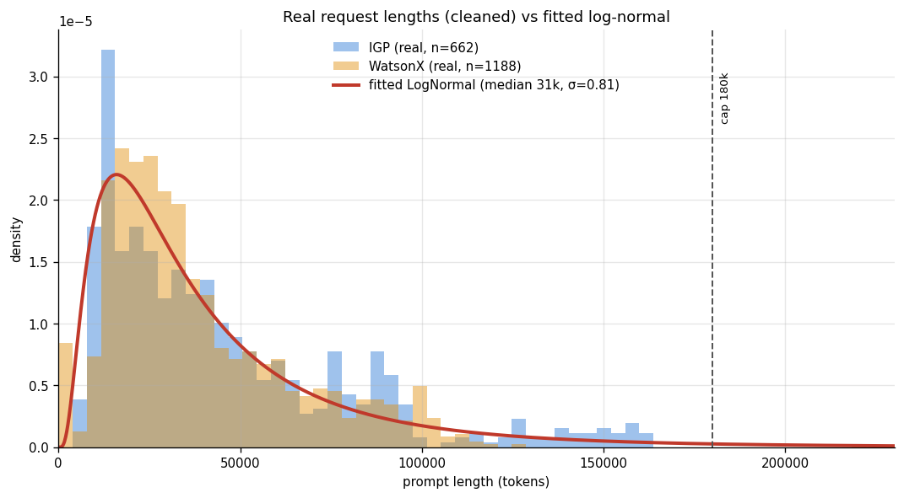
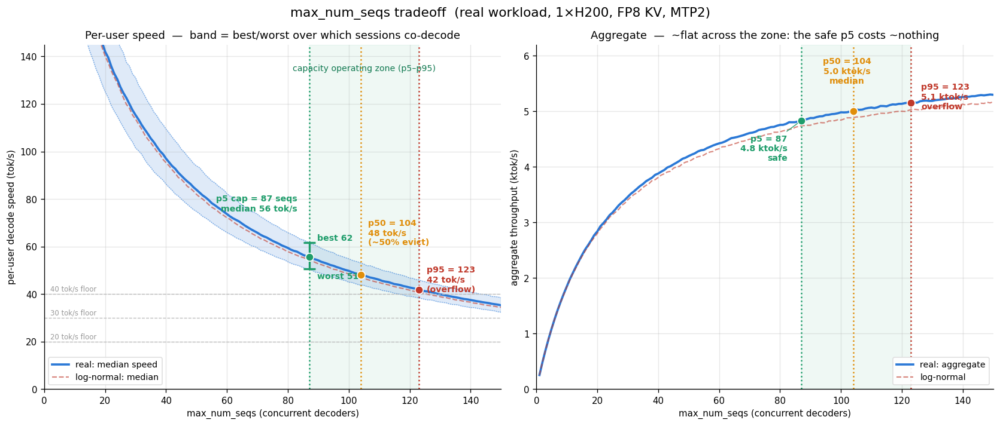
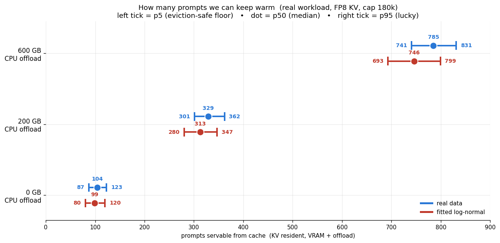

# Qwen 3.6 prompt caching and parallelism experiments

> The projections below are extended to 2×H200, the 35B-A3B MoE model, subagent
> workloads, system-prompt size, and cache invalidation in
> [scenarios.md](scenarios.md) (with an interactive explorer).

## **Tested setup:**
- 1 x H200 = 141 GB
- Qwen 3.6 27B, FP8 *full* model weights ~ 28.8 GiB, **no** vision encoder
- `max_seq_len = 262144` (model max)
- `max_num_batched_tokens = 32768`
- `max_num_seqs = 6`
- inference on vLLM `0.19.0`
- native `--enable-prefix-caching`
- MTP speculative decoding with 2 tokens decoded per forward pass

## **Goal: finding the true KV cache size P expressed as the number of tokens' KV that can fit into the GPU's memory at a time.**
**Note: when talking about KV cache and tokens' KV, we actually mean KV cache + Gated Delta Net states** -> need to see how much memory each of the components consume relative to one another
- We should normally be able to get this information from vLLM's startup log, but 0.19.0 has a [known issue](https://github.com/vllm-project/vllm/issues/37121) that causes the reported number to be wrong.
- **vLLM reports `GPU KV cache size: 352,000 tokens`, so P = 352k tokens**. Quick experiments quickly confirmed this to be untrue.
- **vLLM also reports `Maximum concurrency 5.1× @ 262,144`**. However 352k / 262k = 1.34, confirming the reported P figure to be wrong.

## **Method:**
- Harvest actual prompts from kilo code logs. To make sure one prompt can't reuse the cache of another prompt, we injected UIDs at the very beginning of all prompts' system prompt, conditioning the KV of following tokens to this UID's KV.
- Send n prompts in parallel, in 3 rounds.
- Each prompt's length is S = 140k tokens. 
- Collect prefill and decoding speeds for each prompt in each round.
- Swept 7 <= n <= 10
- We measure full cache hits only. We flag warm as true if ttft < 0.4*cold. The heuristic was confirmed once using vLLM's prometheus endpoint, then assumed to be true.

## **Results:** 

- At N=10 the working set exceeds the cache and each round cycles through all prompts in order, so LRU evicts each prompt just before its turn comes around again (Bélády's cyclic-access worst case). This collapses the hit rate to ~0% rather than a graceful fraction.
- P sits in [1139k, 1399k] tokens
- 5.1 * 262144 = 1337k tokens, which sits in the empirical interval. This leads me to think the 5.1 number might be correct.
- We can hold the full KV of between 4 and 5 full-length sequences.

## **Next steps and recommandations:**
- Lowering `max_seq_len` to 180k would allow us to keep up to 7 full-length sequences warm. It also reduces the worst-case not-cached-sequence PP footprint. 
- FP8 KV cache doubles P and halves KV cache bandwidth during decode.
- RAM/CPU KV cache offloading -> All GPU KV can be reserved for PP/decoding of active sequences. Cached prompts are stored in RAM only. This allows keeping a pool of cached prompts that's larger than the pool of prompts processing at a given time.
- In production, concurrent prompts for the same use case (canonically, agentic pair programming) should share a prefix. Most likely the system prompt of the coding agent. This requires restructuring prompts so that the stable bulk between turns (the prefix) is positioned at the beginning of each prompt.

## **Projections:**

### **Supplementary hypotheses**
- MTP2 speeds up decode by 70% so about 47% per-draft acceptance (conservative compared to Quentin's tests at 87%).

### **FP8 quantization:**
- FP8 KV `--kv-cache-dtype fp8_e4m3` -> 2 x P with minimal performance impact [as reported by vLLM](https://vllm.ai/blog/2026-04-22-fp8-kvcache)

### **Distribution of prompt length:**
- Monte-Carlo simulation of the prompt pool fill: two distributions were used for capcity calculations sampling. Bootstrapping from my own personal data (1188 responses from watsonX and 662 responses from IGP, mainly collected through my usage of coding agents), and parametric sampling from a log-normal distribution fitted to the real data (median=31k, std. dev.=0.81).

### **`max_num_seqs` scaling**
- Mainly VRAM-bound

- maximize aggregate decode by setting `max_num_seqs` to fill VRAM with active sequences. RAM offloading doesn't change this number

### Impact of CPU KV cache offloading

**Issues with the current setup:**
- More than 30k tokens of system prompt, skills, rules, workflows
